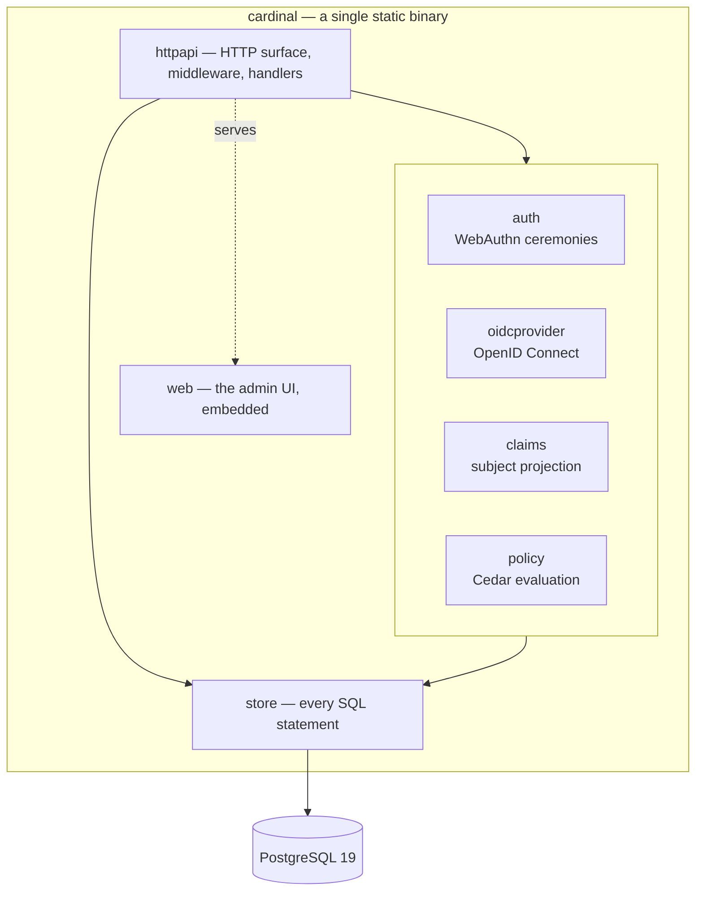
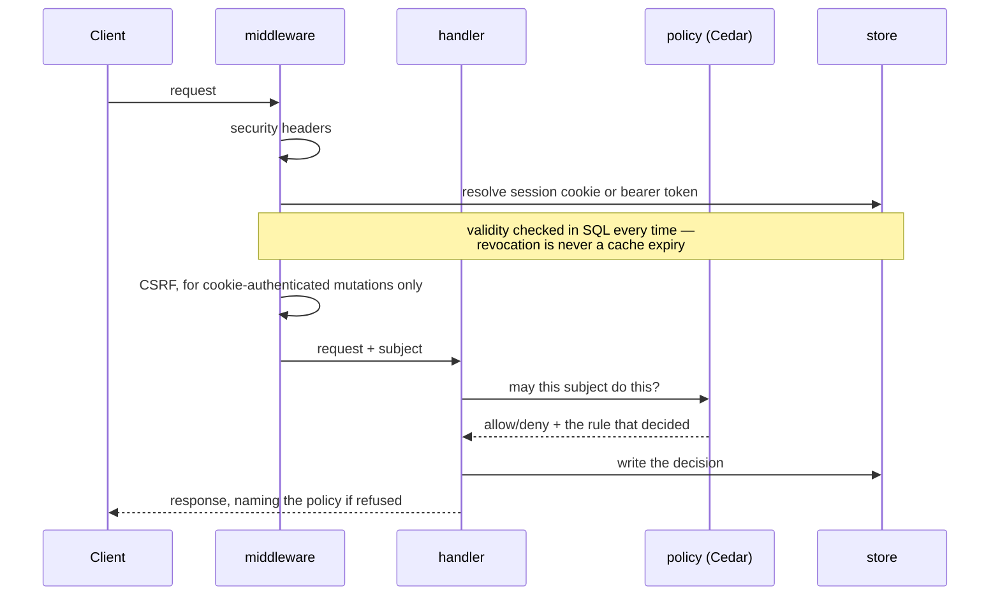

# Architecture

How Cardinal is built internally. For how it sits among other systems see
[integration.md](integration.md); for the tables see
[schema.md](schema.md), which is generated.

## One binary, one database



There is no second process, no cache, no queue and no sidecar. `make release`
produces one binary containing the compiled admin UI
([`embed.FS`](../web/embed.go)), so deploying Cardinal is copying a file and
pointing it at a database.

That is a deliberate constraint rather than minimalism for its own sake: an
identity provider is a single point of catastrophic failure, and every
additional moving part is another way for nobody to be able to log in.

## The packages, and why the seams are where they are

| Package | Responsibility | The rule it obeys |
|---|---|---|
| `internal/store` | Every SQL statement in the product | Nothing above it writes SQL, so validity and revocation are enforced in one place |
| `internal/directory` | Entity types and the schema registry | Knows nothing about HTTP |
| `internal/auth` | WebAuthn registration and login ceremonies | The only package that understands a credential |
| `internal/claims` | Turns a session into a *subject* — attributes plus transitive groups | **Imports no protocol package.** Enforced by a test |
| `internal/policy` | Cedar: entity projection, evaluation, named decisions | Fails closed if no policy is loaded |
| `internal/oidcprovider` | The OpenID Connect provider, over `zitadel/oidc` | Adapts Cardinal's storage to the library's interfaces |
| `internal/httpapi` | Routing, middleware, handlers | The only package that knows what a request is |
| `internal/event` | The hash-chained journal and its payload allowlist | Refuses anything that could carry personal data |
| `web` | React admin UI, embedded at build time | Talks only to the same public API |

The seam that matters most is `claims`. It answers *"who is this subject, and
what are they a member of"* once, and four consumers serialise that answer
differently — ID token claims, `X-Auth-Request-*` headers, SCIM attributes, SSH
certificate principals. If protocol types leaked into it, each consumer would
grow its own resolution path and they would drift; the import constraint is
checked by a test rather than by discipline.

## A request



Two properties fall out of that order. Authentication runs before CSRF, so CSRF
can ask *how* the request authenticated rather than guessing from headers. And
every refusal carries the name of the rule that produced it, which is what makes
the decision explorer possible — neither FreeIPA nor Keycloak can answer "why
was I denied?".

## The four decision points

Cedar is the only authorization engine, and it answers four questions. This list
is the scope: in-app permissions are deliberately not on it
([ADR 0019](adr/0019-in-app-authorization.md)).

| Question | Replaces | Where |
|---|---|---|
| May they reach this URL? | oauth2-proxy + Keycloak mappers | `forwardAuth` |
| May they use this application? | — | OIDC authorize |
| May they change this directory object? | LDAP ACLs | admin API |
| May they log into this host, as whom? | FreeIPA HBAC | SSH CA *(Phase 4)* |

Policy lives in [`policies/cardinal.cedar`](../policies/cardinal.cedar), is
versioned in the database, and is activated with one command — so changing who
may do what is not a deployment.

Some rules are *forbids* that no permit can override, and they carry more weight
than they look:

```cedar
@id("admin-requires-fresh-device-bound-auth")
forbid (principal, action in [...], resource)
unless { principal.deviceBound && principal.authAgeSeconds <= 300 };
```

That single rule is why an access token — never device-bound
([ADR 0018](adr/0018-access-tokens-are-a-weaker-credential.md)) — cannot
administer anything, without a line of policy having been written for tokens.

## Credentials

Nothing is stored in a form that can be presented back to Cardinal.

| Credential | Stored as | Bounded by |
|---|---|---|
| Passkey | Public key | Clone detection on the signature counter |
| Session | SHA-256 of the token | Sliding idle window, hard absolute cap |
| Access token | SHA-256 of the token | `tstzrange`, revocable |
| Recovery code | Argon2id | Single use |
| Enrollment invitation | SHA-256 | Single use, 24h |
| OIDC client secret | Argon2id | — |

Session and access tokens use SHA-256 rather than Argon2id deliberately: both
are 256 bits of machine randomness, so there is nothing to brute-force and a
slow hash would only add latency to every request. Recovery codes are shorter
and human-handled, which is the case Argon2id exists for.

## Two things that constrain every change

**The event journal is append-only and hash-chained.** Each event carries its
predecessor's hash, so an edit or deletion is detectable — `cardinal audit
verify` walks it. There is deliberately **no foreign key from `events` to
`entities`**, because erasing a person must not be able to break the chain. The
payload allowlist ([ADR 0010](adr/0010-personal-data-and-erasure.md))
refuses free text for the same reason: the journal is the one place erasure
cannot reach.

**Time is a first-class column.** Membership, sessions, tokens and policy
bindings all carry a `tstzrange`. Access expires because a range closed, not
because a job ran, and PostgreSQL's `WITHOUT OVERLAPS` makes contradictory
grants impossible at the constraint level rather than in application code.

## Building it

```
make up        # PostgreSQL 19 in Docker
make migrate   # apply the embedded schema
make release   # UI + binary, one self-contained file
make test      # unit and integration, against a real database
make e2e-up    # Traefik, Cardinal, a protected app, an OIDC client
make schema    # regenerate docs/schema.md from the live database
```

Integration tests run against real PostgreSQL via testcontainers rather than a
mock, because `WITHOUT OVERLAPS`, `FOR PORTION OF` and range semantics cannot be
mocked — and they are the heart of the data model.
