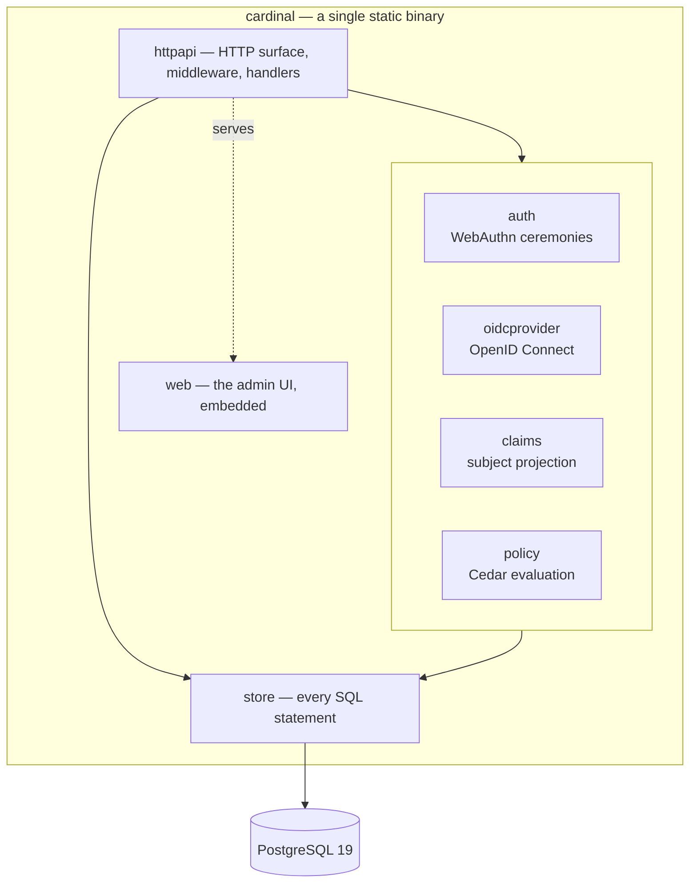
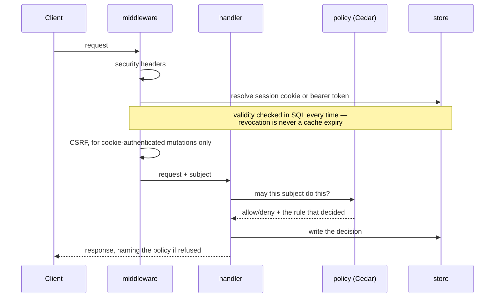

# Architecture

How Cardinal is built internally. For how it sits among other systems see
[integration.md](integration.md); for the tables see
[schema.md](schema.md), which is generated.

## One binary, one database



There is no second process, no cache, no queue and no sidecar. `make release`
produces one binary containing the compiled admin UI
([`embed.FS`](https://github.com/Londer-Org/Cardinal/blob/main/web/embed.go)), so deploying Cardinal is copying a file and
pointing it at a database.

That is a deliberate constraint rather than minimalism for its own sake: an
identity provider is a single point of catastrophic failure, and every
additional moving part is another way for nobody to be able to log in.

## The packages, and why the seams are where they are

Six groups, and the grouping is the dependency graph rather than a filing
preference. `go list` will confirm every arrow below.

### `internal/directory` — the model, and nothing else

Depends on nothing. Everything else depends on some of it.

| Package | Responsibility | The rule it obeys |
|---|---|---|
| `directory` | Entity types and the schema registry | Knows nothing about HTTP |
| `directory/temporal` | Validity periods | The shape of every grant, not a feature of one |
| `directory/event` | The hash-chained journal and its payload allowlist | Refuses anything that could carry personal data |
| `directory/posix` | The uid and gid numbers this deployment hands out | A fact about Unix, not about storage — which is why `config` can read it without depending on the database |

### `internal/store` — every SQL statement in the product

Depends only on the model. Nothing above it writes SQL, so validity and
revocation are enforced in one place.

### `internal/server` — the thing that answers requests

| Package | Responsibility | The rule it obeys |
|---|---|---|
| `server/httpapi` | Routing, middleware, handlers | The only package that knows what a request is |
| `server/auth` | WebAuthn registration and login ceremonies | The only package that understands a credential |
| `server/claims` | Turns a session into a *subject* — attributes plus transitive groups | **Imports no protocol package.** Enforced by a test |
| `server/policy` | Cedar: entity projection, evaluation, named decisions | Fails closed if no policy is loaded |
| `server/oidcprovider` | The OpenID Connect provider, over `zitadel/oidc` | Adapts Cardinal's storage to the library's interfaces |
| `server/acme` | JWS, JWK thumbprints and external account binding | Refuses `none` and the HMAC family everywhere but the binding |
| `server/mail` | Notification email: templates, outbox, delivery | Sends news. Nothing it sends authorises anything (ADR 0009) |

### `internal/host` — what runs on a managed machine

**This group imports nothing from the rest of the tree.** That is not a
convention being observed; it is what `go list` reports, and it is why
`cardinal-agent` can be a separate binary with a separate release cadence.

| Package | Responsibility | The rule it obeys |
|---|---|---|
| `host/agent` | The host's assignment, its cache, and the lookup index | Never blocks on Cardinal being reachable |
| `host/machine` | The *machine's* half of host authentication — its keypair, enrollment and request signing | Shared by the CLI and the agent, so the signing rules exist once |
| `host/userdb` | POSIX identity over systemd's varlink interface | Standard library only — no varlink dependency, no cgo |
| `host/sudoers` | Renders and installs `/etc/sudoers.d/50-cardinal` | Writes one file, reads none — it cannot remove local root |
| `host/shadow` | Compares a cutover against what the machine does today | Asks the system through `getent` and `sudo`; writes nothing |

### `internal/ca` — the two certificate authorities

| Package | Responsibility | The rule it obeys |
|---|---|---|
| `ca/sshca` | Signs SSH certificates | Holds no key; is handed one per call |
| `ca/x509ca` | Holds the X.509 authority's encryption key | A small surface around the one secret that can issue for any name |

### The rest

`internal/config` reads and validates the file, and depends on nothing but
`directory/posix`. `internal/version` reports which build this is. `web` is the
React admin console, embedded at build time, talking only to the same public
API.

The seam that matters most is `claims`. It answers *"who is this subject, and
what are they a member of"* once, and four consumers serialise that answer
differently — ID token claims, `X-Auth-Request-*` headers, SCIM attributes, SSH
certificate principals. If protocol types leaked into it, each consumer would
grow its own resolution path and they would drift; the import constraint is
checked by a test rather than by discipline.

## A request



Two properties fall out of that order. Authentication runs before CSRF, so CSRF
can ask *how* the request authenticated rather than guessing from headers. And
every refusal carries the name of the rule that produced it, which is what makes
the decision explorer possible — neither FreeIPA nor Keycloak can answer "why
was I denied?".

## The four decision points

Cedar is the only authorization engine, and it answers four questions. This list
is the scope: in-app permissions are deliberately not on it
([ADR 0019](adr/0019-in-app-authorization.md)).

| Question | Replaces | Where |
|---|---|---|
| May they reach this URL? | oauth2-proxy + Keycloak mappers | `forwardAuth` |
| May they use this application? | — | OIDC authorize |
| May they change this directory object? | LDAP ACLs | admin API |
| May they log into this host, as whom? | FreeIPA HBAC | SSH CA |

The last row is asked twice, of two different things. Certificate issuance asks
it of a person holding a credential, and the answer is logged. The host
assignment endpoint asks the same question of every user, so a machine learns
the POSIX records of the people who may log into it and nobody else
([ADR 0025](adr/0025-a-host-learns-only-its-own-people.md)) — which is what
stops a compromised build agent from yielding the whole staff list, the way an
LDAP-bound host does.

Policy lives in [`policies/cardinal.cedar`](https://github.com/Londer-Org/Cardinal/blob/main/policies/cardinal.cedar), is
versioned in the database, and is activated with one command — so changing who
may do what is not a deployment.

Some rules are *forbids* that no permit can override, and they carry more weight
than they look:

```cedar
@id("admin-requires-fresh-device-bound-auth")
forbid (principal, action in [...], resource)
unless { principal.deviceBound && principal.authAgeSeconds <= 300 };
```

That single rule is why an access token — never device-bound
([ADR 0018](adr/0018-access-tokens-are-a-weaker-credential.md)) — cannot
administer anything, without a line of policy having been written for tokens.

## Credentials

Nothing is stored in a form that can be presented back to Cardinal.

| Credential | Stored as | Bounded by |
|---|---|---|
| Passkey | Public key | Clone detection on the signature counter |
| Session | SHA-256 of the token | Sliding idle window, hard absolute cap |
| Access token | SHA-256 of the token | `tstzrange`, revocable |
| Recovery code | Argon2id | Single use |
| Enrollment invitation | SHA-256 | Single use, 24h |
| Host enrollment token | SHA-256 | Single use, 1h |
| Host key | Public key | `tstzrange`, retired on re-enrollment |
| OIDC client secret | Argon2id | — |

Session and access tokens use SHA-256 rather than Argon2id deliberately: both
are 256 bits of machine randomness, so there is nothing to brute-force and a
slow hash would only add latency to every request. Recovery codes are shorter
and human-handled, which is the case Argon2id exists for.

Two rows have no hash at all, and they are the interesting ones. A passkey and a
host key are *public* keys: the holder proves possession by signing, so a
database read yields the ability to recognise a principal and never to be one.
That is the same reason there is no password column, applied to machines
([ADR 0024](adr/0024-hosts-prove-possession-not-a-secret.md)).

## The agent, and why an outage is not an outage

`cardinal-agent` runs on every managed host. It fetches that machine's
assignment, keeps it in `/var/lib/cardinal/assignment.json`, and serves POSIX
identity to `nss-systemd` over a Unix socket
([ADR 0020](adr/0020-posix-identity-over-varlink.md)).

The ordering is the whole design: **the cache answers lookups, and the network
only updates it.** A failed refresh is a log line, never a state change. An
agent that dropped its records when Cardinal became unreachable would turn a
directory outage into a fleet outage — everybody locked out of every machine at
once, which is the thing that makes people distrust centralised identity.

The same property, twice over:

| Question | Answered by | Survives a Cardinal outage |
|---|---|---|
| Who is uid 100003? | the agent's cache | yes |
| May they log in? | a certificate issued minutes ago | yes, until it expires |
| May they run as root? | `/etc/sudoers.d/50-cardinal` on disk | yes |
| Is this really web-01? | a host certificate valid for days | yes |

That last row is the most visible thing in the project. One line of
`known_hosts` — `@cert-authority *.prod <key>` — replaces every fingerprint
anybody would otherwise have been asked to accept, and clients can then run
`StrictHostKeyChecking=yes` and get a hard failure instead of a prompt
([ADR 0027](adr/0027-a-machine-proves-its-own-name.md)). The names a machine may
prove come from the directory; nothing in its request is consulted.

The sudoers file is rendered from the same assignment and validated with
`visudo -c` before it is moved into place, so a bad render leaves the previous
file untouched. It grants `NOPASSWD` because Cardinal has no passwords — what
actually gates sudo is the certificate that produced the shell, which is a
stronger check than a password prompt and has one consequence worth reading
before deploying ([ADR 0026](adr/0026-sudo-is-as-strong-as-the-shell.md)).

It is a separate binary from `cardinal` because the two have opposite
requirements — the CLI talks to the database from a workstation, the agent talks
only to the HTTP API and runs unattended as root on a thousand machines — and it
is deliberately not a container, because it serves a socket `nss-systemd` must
reach and has to survive a reboot before any container runtime starts. It ships
as a `.deb` and `.rpm` that install files and nothing else
([ADR 0030](adr/0030-the-package-installs-and-reports.md)); `cardinal-agent
doctor` reports what the machine still needs.

## Two things that constrain every change

**The event journal is append-only and hash-chained.** Each event carries its
predecessor's hash, so an edit or deletion is detectable — `cardinal audit
verify` walks it. There is deliberately **no foreign key from `events` to
`entities`**, because erasing a person must not be able to break the chain. The
payload allowlist ([ADR 0010](adr/0010-personal-data-and-erasure.md))
refuses free text for the same reason: the journal is the one place erasure
cannot reach.

**Time is a first-class column.** Membership, sessions, tokens and policy
bindings all carry a `tstzrange`. Access expires because a range closed, not
because a job ran, and PostgreSQL's `WITHOUT OVERLAPS` makes contradictory
grants impossible at the constraint level rather than in application code.

## Building it

```
make up        # PostgreSQL 19 in Docker
make migrate   # apply the embedded schema
make release   # UI + binary, one self-contained file
make test      # unit and integration, against a real database
make e2e-up    # Traefik, Cardinal, a protected app, an OIDC client
make schema    # regenerate docs/schema.md from the live database
```

Integration tests run against real PostgreSQL via testcontainers rather than a
mock, because `WITHOUT OVERLAPS`, `FOR PORTION OF` and range semantics cannot be
mocked — and they are the heart of the data model.
