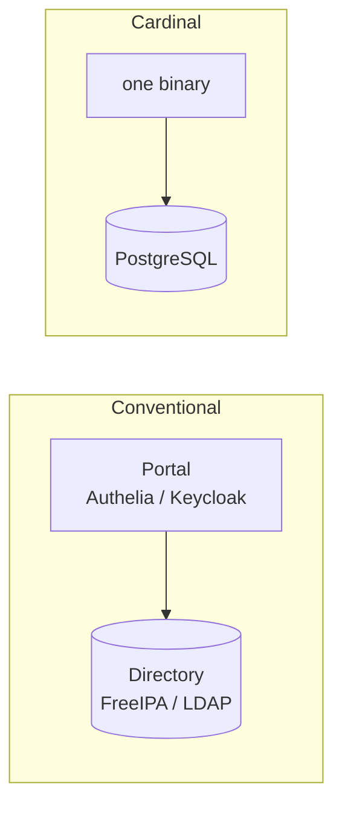

# Cardinal compared to what already exists

Written to be useful when deciding *against* Cardinal, which is the only kind of
comparison worth reading. Cardinal is pre-1.0, written by one person, and has
had no external security review. Everything below is more mature than it is.

## The distinction that decides most of this

Most products in this space are one of two things, and conflating them makes
every comparison confusing:

**A directory** holds the accounts. Who exists, what groups they are in, what
their POSIX identity is. *FreeIPA, OpenLDAP, Active Directory, Kanidm.*

**A portal** authenticates people and gates applications. It usually holds no
accounts at all. *Authelia, oauth2-proxy, Keycloak (mostly).*

A working stack needs both, which is why real deployments look like
`Authelia + FreeIPA` or `Keycloak + FreeIPA` rather than either alone.

**Cardinal is trying to be both.** That is the whole bet, and every advantage and
every risk below follows from it.

## Authelia

An authentication portal: `forwardAuth` for reverse proxies, an OIDC provider,
WebAuthn and TOTP, access rules in YAML. Light, well documented, easy to
configure — the reputation is deserved.

**It has no user store.** The authentication backend is either a File (a YAML
file of users with hashed passwords) or LDAP, one at a time. Which is why it is
deployed in front of FreeIPA rather than instead of it.

| | Authelia | Cardinal |
|---|---|---|
| `forwardAuth` | ✅ | ✅ |
| OIDC provider | ✅ | ✅ |
| WebAuthn / passkeys | ✅ | ✅ passkey-only |
| Holds accounts | ❌ File or LDAP backend | ✅ it is the directory |
| Group membership that expires | ❌ | ✅ temporal by default |
| Policy language | YAML rules, web only | Cedar, across web / SSH / sudo / admin |
| "Why was I denied?" | logs | the deciding rule, named |
| POSIX / SSH / sudo | ❌ | Phase 4 |

**Choose Authelia if** you have a directory already and want web SSO in front of
it. It is lighter, it is finished, and Cardinal offers you nothing for the extra
risk.

**Cardinal is a different proposition:** it aims to remove the directory behind
the portal, not to be a better portal.

One consequence worth knowing: Cardinal cannot serve as Authelia's LDAP backend,
and not for reasons of principle. Authelia's LDAP backend expects to validate a
password held in the directory. Cardinal has no password column, so the
combination cannot authenticate anybody — see
[ADR 0002](adr/0002-identity-is-an-immutable-uuid.md).

## Keycloak

The heavyweight. Realms, identity brokering, user federation, SAML *and* OIDC,
fine-grained authorization services, an admin API for everything. If a protocol
exists, Keycloak probably speaks it.

**Choose Keycloak if** you need SAML, brokering to other IdPs, or the operational
comfort of something with commercial support behind it. Cardinal deliberately
does not implement SAML at all ([ADR 0007](adr/0007-no-saml.md)) — XML signature
verification is an authentication-bypass minefield and not shipping it is a
security position, but it is also a hard limit.

Keycloak is usually deployed against an existing directory too, so it lands in
the same "portal" column as Authelia despite being far larger. The common
complaint — and the reason Authelia keeps winning in smaller shops — is
configuration weight, not capability.

## FreeIPA

The thing Cardinal is actually competing with, and the honest comparison is less
flattering than it first looks.

| | FreeIPA | Cardinal |
|---|---|---|
| Linux host login | ✅ SSSD, LDAP + Kerberos | Phase 4, SSH certificates instead |
| POSIX identity | ✅ | Phase 4, [via varlink](adr/0020-posix-identity-over-varlink.md) |
| sudo / HBAC rules | ✅ | Phase 4, Cedar policy |
| **Internal DNS** | ✅ | ❌ **not in scope, ever** |
| **Internal CA** | ✅ | ❌ **not in scope** — integrate `step-ca` |
| Kerberos KDC | ✅ | ❌ not in scope |
| LDAP for legacy apps | ✅ | ❌ by design |
| Temporal membership | ❌ | ✅ |
| Policy as versioned code | ❌ | ✅ |
| Tamper-evident audit | ❌ | ✅ hash-chained |
| Passwordless | ❌ | ✅ no password column |

**Cardinal cannot fully replace FreeIPA**, and it is worth being blunt about it.
A site keeping FreeIPA for DNS and certificates keeps FreeIPA. Cardinal targets
one of its three jobs — host login — and explicitly declines the other two.

Where Cardinal is genuinely better is not feature count. It is that access
expires on its own, policy is one reviewable artefact instead of three
incompatible ones, and every refusal can say which rule produced it. FreeIPA
cannot answer "why was I denied?" and neither can Keycloak.

## Kanidm

The closest comparison, and the one to actually evaluate before building
anything. Rust, passkey-first, self-hosted, OAuth2/OIDC, Unix host integration,
and — unlike Cardinal — a working LDAP compatibility interface for legacy
applications. It is further along and has more than one maintainer.

**Deploy Kanidm before committing to Cardinal.** The project plan says this too.
One day of evaluation against months of building is a good trade, and if it fits,
it fits.

The defensible reasons to build anyway are narrow and specific:

- **PostgreSQL as the substrate.** Kanidm uses a bespoke storage engine. Cardinal
  gets SQL, real transactions, streaming replication, PITR, and a backup story an
  operator already understands.
- **Temporal access as a data-model primitive**, not a feature bolted on. A grant
  carries a validity range and expires because a range closed.
- **Cedar across every decision point** — web, SSH, sudo, and the directory's own
  admin API — versioned in git and testable in CI.

If none of those matter to you, Kanidm is the better choice today.

## Univention Corporate Server

An integrated platform aimed at replacing a Windows domain controller: its own
LDAP, Keycloak for SSO, domain join for Windows clients, an app catalogue.

Relevant because it solves a problem Cardinal does not touch at all: **Windows
endpoints**. Cardinal has nothing to say about domain join, Group Policy, or
Windows device login, and a site with a Windows fleet will need Entra ID or
something like UCS regardless of what it does about Linux and web SSO.

Same structural shape as the rest: Keycloak in front, LDAP behind.

## Where Cardinal is the wrong choice

Stated plainly, because a comparison that concludes "use mine" is marketing.

- **You need SAML.** Not implemented, and not planned.
- **You need DNS or an internal CA from the same product.** Out of scope.
- **You have Windows endpoints to manage.** Cardinal does nothing for them.
- **You have applications that can only bind LDAP and cannot sit behind a proxy.**
  There is no LDAP server and the passwordless design means a simple bind has no
  password to check.
- **You want something finished.** It is pre-1.0, one maintainer, and has had no
  external security review. For a security product that last point is not a
  detail.
- **You already run a directory and only need web SSO.** Authelia is lighter and
  done.

## Where it earns its place

- The directory and the policy engine are the same system, so "who may do what"
  has one answer rather than three that drift.
- Access expires by itself, because validity is a column rather than a process.
- Every decision names the rule that made it — the question neither FreeIPA nor
  Keycloak can answer.
- One binary and one database, with no cache, queue or second datastore to back
  up, fail over, or reason about at three in the morning.
