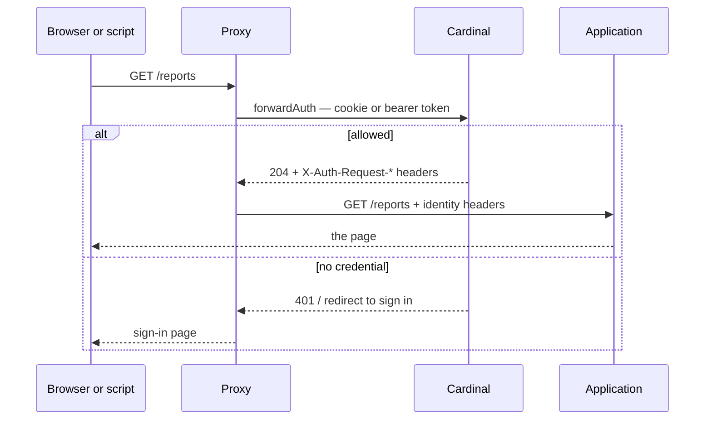

# Cardinal and the systems around it

What talks to Cardinal, how, and where the trust boundaries are. For Cardinal's
internals see [architecture.md](architecture.md).

## The whole picture


## They are layers, not alternatives

Two integration styles — but **not a choice between them**. They sit at
different layers and compose freely:

| Combination | What it looks like | When |
|---|---|---|
| forwardAuth only | The proxy gates the app; the app implements nothing | Most internal applications |
| OIDC only | The app runs its own login and owns its session | The app is not behind the proxy, or wants its own session lifecycle |
| **Both** | The proxy gates the host; the app *also* runs OIDC | Defence in depth — unauthenticated traffic never reaches the app, and the app still gets a real identity and refresh tokens |

Using both costs the user nothing, because they share the same Cardinal
session. Signing in once at the proxy gate means the app's subsequent OIDC
authorization completes silently — that is single sign-on working, not a second
login:

```
session cookie ──▶ forwardAuth      ──▶ 204 + identity headers
               └─▶ /oidc/authorize  ──▶ code, no interactive step
```

### One wrinkle if you use both

The two decision points name the application differently:

| Door | Cedar resource |
|---|---|
| `forwardAuth` | `Application::"<Host header>"` — e.g. `Application::"aura.example.com"` |
| OIDC (`AccessApplication`) | `Application::"<registered name>"` — e.g. `Application::"aura"` |

So a policy granting access to `Application::"aura"` does **not** grant access
to its URL, and vice versa. An application using both needs a rule for each,
under each name. That is a rough edge rather than a design: nothing today links
a registered application to the hostnames it answers on, so `forwardAuth` has
only the `Host` header to key on. Worth knowing before writing policy, and
recorded as a gap in the [roadmap](../ROADMAP.md).

## Style 1 — the proxy asks, the app trusts headers

The cheapest integration, and the one to prefer. The application implements
**nothing**: no login page, no token handling, no OIDC library.



The application receives:

| Header | Meaning |
|---|---|
| `X-Auth-Request-User` | The subject's UUID — stable forever |
| `X-Auth-Request-Preferred-Username` | Login, for display |
| `X-Auth-Request-Name` | Display name |
| `X-Auth-Request-Groups` | Group **names**, for display |
| `X-Auth-Request-Group-Ids` | Group **identifiers** — branch on these |
| `X-Auth-Request-Auth-Method` | `passkey` or `access_token` |
| `X-Auth-Request-Device-Bound` | Whether the credential is hardware-bound |

**Use the identifiers, not the names.** A group's name is a mutable attribute
here by design ([ADR 0002](adr/0002-identity-is-an-immutable-uuid.md)), so an
application branching on the string `"aura-admins"` has coupled itself to
something Cardinal intends to be renameable — and the day it is renamed, people
lose access with no error anywhere. The names are for showing a human.

### The trust boundary, stated plainly

The application believes those headers because **only the proxy can reach it**.
That is an assumption about the network, not something Cardinal can enforce, and
it is the same assumption `X-Forwarded-For` rests on:

- The application must not be reachable except through the proxy.
- The proxy must strip any inbound `X-Auth-Request-*` from clients, or a caller
  can simply assert who they are.
- Cardinal's `trusted_proxies` must list the proxy, or it will not believe the
  forwarded host and path either.

Get those three wrong and the header model is an open door. Get them right and
the application needs no security code at all, which is the whole point.

## Style 2 — the application speaks OpenID Connect

For applications that want their own session, or run somewhere the proxy does
not sit in front of. Cardinal is a standard OIDC provider: authorization code
flow with PKCE, discovery, JWKS, refresh tokens.

```
https://cardinal.example/.well-known/openid-configuration
```

Registered with `cardinal app register <name> -redirect <uri>`. The
`groups` scope adds `groups` and `group_ids` claims — the same distinction as
above applies.

The discovery document describes *this deployment* rather than the library's
defaults ([ADR 0016](adr/0016-cardinal-serves-its-own-discovery-document.md)):
authorization code only, PKCE required, no implicit flow.

## Scripts and automation

The case that usually forces a hole in the edge. An API client cannot complete
an interactive sign-in, so the common workaround is a routing rule matching the
`Authorization` header and sending API traffic *around* the auth check — which
means that traffic reaches no policy decision and appears in no log.

Cardinal accepts `Authorization: Bearer crd_pat_…` wherever it accepts a session
cookie, so there is nothing to route around:

```bash
cardinal token create alonfils -name "nightly export" -for 90d
curl -H "Authorization: Bearer crd_pat_…" https://app.example/api/reports
```

One proxy rule, no priorities, no bypass. The application still reads only the
identity headers and needs no idea that tokens exist.

A token is deliberately a **weaker** credential than a passkey
([ADR 0018](adr/0018-access-tokens-are-a-weaker-credential.md)): never
device-bound, so existing policy refuses it every administrative action and
every SSH certificate. A token belonging to a full directory administrator
still cannot administer.

## Where authorization stops

Cardinal answers *may you reach this* and *who are you*. It does not answer
*may you delete record 4213* — an application's own permissions stay the
application's business, and [ADR 0019](adr/0019-in-app-authorization.md) records
why that boundary is where it is rather than an oversight.

So the contract is: **Cardinal owns identity, membership and reachability; the
application owns its own semantics.** Group identifiers are what crosses the
line, and time-bounded membership is what makes them worth trusting — a grant
that expires on its own is one nobody has to remember to remove.

## What Cardinal deliberately does not speak

| Not implemented | Why |
|---|---|
| LDAP server | The DN-as-identity model is the problem, not the transport ([ADR 0002](adr/0002-identity-is-an-immutable-uuid.md)) |
| SAML | XML signature verification is an authentication-bypass minefield ([ADR 0007](adr/0007-no-saml.md)) |
| Kerberos | Not used in the target environment, and a KDC dwarfs this project |
| RADIUS | PostgreSQL removed its own support as unfixably insecure over UDP |

Reading LDAP as a *client* during a migration is fine and planned; being an LDAP
*server* is not.

## Failure modes worth knowing before deploying

**Cardinal is down.** Nobody can sign in anywhere — inherent to centralised
identity. Existing sessions and access tokens keep working until the proxy next
asks, and the proxy asks on every request, so in practice new requests fail.
This is why the Phase 4 host design authorizes at certificate *issuance*: SSH is
the one path built to survive a full outage.

**The database is lost.** Worse than downtime and the risk that actually
matters. `pgBackRest` with PITR from day one, and `make restore-drill` restores
into a scratch database and verifies the audit chain — an untested backup is not
a backup.

**A group is renamed.** Applications keyed on `X-Auth-Request-Group-Ids` are
unaffected. Applications keyed on names silently break, which is the entire
reason both are sent.

**A credential leaks.** Sessions and tokens are revocable at read time, checked
in SQL on every request rather than by anything expiring from a cache. Disabling
an account revokes both. Access tokens carry a `crd_pat_` prefix so a secret
scanner can recognise one in a repository or a pasted log.
