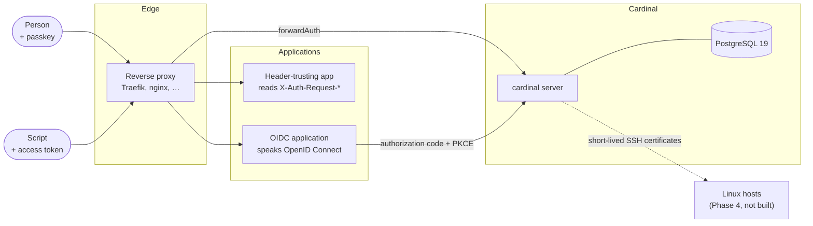
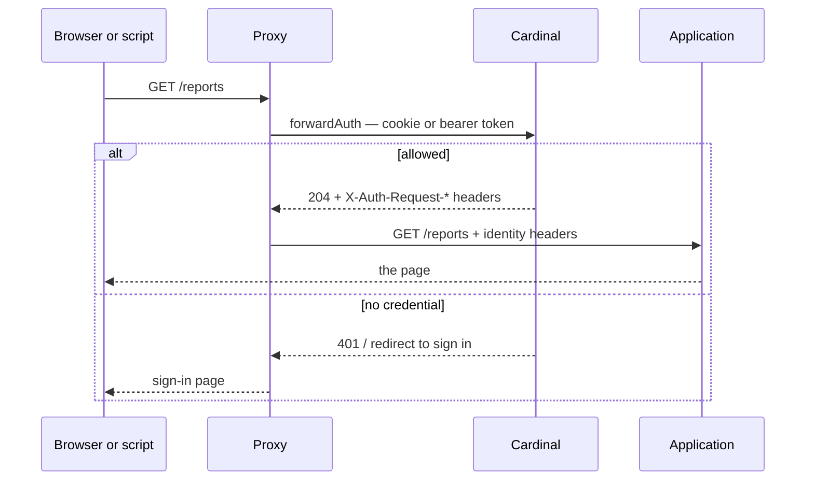

# Cardinal and the systems around it

What talks to Cardinal, how, and where the trust boundaries are. For Cardinal's
internals see [architecture.md](architecture.md).

## The whole picture



## They are layers, not alternatives

Two integration styles — but **not a choice between them**. They sit at
different layers and compose freely:

| Combination | What it looks like | When |
|---|---|---|
| forwardAuth only | The proxy gates the app; the app implements nothing | Most internal applications |
| OIDC only | The app runs its own login and owns its session | The app is not behind the proxy, or wants its own session lifecycle |
| **Both** | The proxy gates the host; the app *also* runs OIDC | Defence in depth — unauthenticated traffic never reaches the app, and the app still gets a real identity and refresh tokens |

Using both costs the user nothing, because they share the same Cardinal
session. Signing in once at the proxy gate means the app's subsequent OIDC
authorization completes silently — that is single sign-on working, not a second
login:

```
session cookie ──▶ forwardAuth      ──▶ 204 + identity headers
               └─▶ /oidc/authorize  ──▶ code, no interactive step
```

### Both doors name the same application

| Door | Cedar resource |
|---|---|
| `forwardAuth` | `Application::"<registered name>"` — e.g. `Application::"aura"` |
| OIDC (`AccessApplication`) | `Application::"<registered name>"` — e.g. `Application::"aura"` |

`forwardAuth` is handed a hostname, so it has to be told which application that
hostname belongs to:

```sh
cardinal application create aura -display 'Aura'
cardinal app hostname add aura aura.example.com
```

A hostname no application claims is refused before policy is consulted, the same
way an SSH certificate is refused for a machine nobody enrolled — the decision
points here answer about things the directory knows. The refusal says so, and
names the command that fixes it.

One hostname belongs to at most one application. Two claiming the same address
would mean the request was authorized against whichever row happened to win.

### Writing the rules

Both doors are governed by Cedar in the database. A whole policy set belongs in
git, tested with `cardinal policy test` before it governs anything — but the
common rules can be composed instead of written, from the CLI or from **Access →
Policy** in the console:

```sh
cardinal policy rule add web-access sre-may-reach-grafana -group sre -app grafana
cardinal policy rule add ssh-login sre-may-log-into-prod \
    -group sre -to env-prod -account deploy
cardinal policy rule list
```

A composed rule is text in the same document, published as an ordinary version
and rolled back with `cardinal policy activate`. Everything the builder does not
recognise — the forbids, the administration tiers, anything with a condition it
cannot express — passes through untouched and cannot be removed that way.

> **Before v0.2.0** this section described a rough edge: `forwardAuth` used the
> `Host` header as the resource name, so a rule about `Application::"aura"` did
> not govern its URL. Worse, the shipped rule matched on a `context.audience`
> that was a constant, so any authenticated user reached any protected URL. Both
> are gone. If you wrote rules against a hostname, they now need the
> application's name.

## Style 1 — the proxy asks, the app trusts headers

The cheapest integration, and the one to prefer. The application implements
**nothing**: no login page, no token handling, no OIDC library.



The application receives:

| Header | Meaning |
|---|---|
| `X-Auth-Request-User` | The subject's UUID — stable forever |
| `X-Auth-Request-Preferred-Username` | Login, for display |
| `X-Auth-Request-Name` | Display name |
| `X-Auth-Request-Groups` | Group **names**, for display |
| `X-Auth-Request-Group-Ids` | Group **identifiers** — branch on these |
| `X-Auth-Request-Auth-Method` | `passkey` or `access_token` |
| `X-Auth-Request-Device-Bound` | Whether the credential is hardware-bound |

**Use the identifiers, not the names.** A group's name is a mutable attribute
here by design ([ADR 0002](adr/0002-identity-is-an-immutable-uuid.md)), so an
application branching on the string `"aura-admins"` has coupled itself to
something Cardinal intends to be renameable — and the day it is renamed, people
lose access with no error anywhere. The names are for showing a human.

**Check your proxy forwards them.** Traefik copies only the response headers
listed in `authResponseHeaders`, and drops the rest silently. Cardinal set
`X-Auth-Request-Group-Ids` on every response for two releases while the example
configuration omitted it from that list, so the header an application is told to
branch on never arrived — and nothing anywhere reported a difference. If a
header in the table above is missing at the application, that list is the first
place to look.

### The trust boundary, stated plainly

The application believes those headers because **only the proxy can reach it**.
That is an assumption about the network, not something Cardinal can enforce, and
it is the same assumption `X-Forwarded-For` rests on:

- The application must not be reachable except through the proxy.
- The proxy must strip any inbound `X-Auth-Request-*` from clients, or a caller
  can simply assert who they are.
- Cardinal's `trusted_proxies` must list the proxy, or it will not believe the
  forwarded host and path either.

Get those three wrong and the header model is an open door. Get them right and
the application needs no security code at all, which is the whole point.

### Access tokens, and what they are for

A script gets a token rather than a passkey. It authenticates its owner and is
never device-bound, so policy refuses it administration and SSH certificates
([ADR 0018](adr/0018-access-tokens-are-a-weaker-credential.md)).

That left everything else the owner could do without a hardware key, which for a
credential living in a CI variable is a grant nobody would write down. So a
token is issued for something:

```sh
cardinal token create ci -name "nightly export" -scope applications
```

| Scope | What it reaches |
|---|---|
| `identity` | Who the token belongs to. Almost every client needs it |
| `applications` | Services behind the proxy. The reason most tokens exist |
| `profile` | The owner's display name and email |
| `decisions` | The decision log — who was refused what, by which rule |
| `policy` | The active policy set |
| `scim` | Provisions accounts, for an identity provider. The one scope that writes to the directory — see below, and note that policy must permit `Provision` as well |
| `events` | Collects the security events queued for a receiver. The only scope whose holder is normally an application rather than a person, issued by `cardinal ssf token <application>` for a polled stream |

A scope only ever narrows. Policy still decides, and the token still cannot
exceed its owner — this answers the question Cedar cannot ask, because Cedar
sees a principal and not the credential that presented it. Scopes cannot be
changed on an existing token, so narrowing one means issuing a new one.

### Provisioning in, over SCIM

An identity provider — Entra, Okta, anything speaking SCIM 2.0 — keeps Cardinal
in step with who exists. The base URL is `https://cardinal.example/scim/v2`, and
it authenticates with an ordinary access token:

```sh
cardinal user create entra-provisioning
cardinal grant provisioners entra-provisioning -reason "Entra SCIM"
cardinal token create entra-provisioning -name "Entra SCIM" -scope scim -for 8760h
```

Two things must be true and neither implies the other: the token carries the
`scim` scope, and policy permits its owner to `Provision`. A provisioner's other
tokens cannot provision, and a scim-scoped token belonging to somebody else
cannot either.

**Provisioning is not administration**, and
[ADR 0031](adr/0031-scim-provisioning-is-its-own-action.md) is the argument.
Every administrative action is guarded by a forbid demanding a device-bound
credential used in the last five minutes; a machine synchronising at 3am has
neither and never will. So `Provision` is its own action, deliberately outside
that forbid — which means anyone reading the step-up rule and concluding "no
unattended credential can change the directory" is wrong, and the rule
permitting this sits directly above it in the shipped policy set so they find
out there.

What bounds it instead:

- **No system group, ever.** `directory-admins`, `user-admins` and
  `security-admins` confer authority inside Cardinal. SCIM refuses to modify one
  with a 403 that says why, so an IdP administrator does not thereby become a
  Cardinal administrator.
- **No credentials.** A provisioned account exists and cannot be signed into
  until its owner enrols a passkey.
- **No POSIX numbers.** They are permanent once served, and an IdP has no idea
  which are taken.

`GET /scim/v2/ServiceProviderConfig` states what is and is not implemented —
bulk operations and sorting are not, filtering and PATCH are. Filters are a
single `attribute eq "value"`, which is what reconciliation sends; anything
compound is refused rather than approximated, because a filter silently misread
returns the wrong people and the client acts on the answer.

### Telling applications when access changes

Revoking a session in Cardinal ends it in Cardinal. An application that issued
its own session from an OIDC login learns nothing until its token expires —
fifteen minutes at best, a refresh cycle at worst. For a compromised account
that gap is the whole incident.

Cardinal transmits [Shared Signals](https://openid.net/wg/sharedsignals/) events
to receivers you configure:

```sh
cardinal app register aura -redirect https://aura.example.com/callback
cardinal ssf stream add aura -endpoint https://aura.example.com/events
cardinal ssf status
```

A receiver that cannot be reached from Cardinal — behind NAT, on a laptop, in a
CI job, or simply somewhere nobody will open an inbound path to a security
event handler — collects instead of being pushed to:

```sh
cardinal ssf stream add aura -delivery poll
cardinal ssf token aura            # shown once
```

```
POST /ssf/poll
Authorization: Bearer crd_pat_…
{"maxEvents": 100, "ack": ["<jti of everything already processed>"]}
```

The response is `{"sets": {"<jti>": "<token>"}, "moreAvailable": false}`.
Acknowledging is a separate act from receiving, so a receiver that crashes
between the two is handed the same events again rather than losing them.

The credential belongs to the application, not to whoever configured the
stream, and it reads that receiver's events and nothing else.

| Event | When |
|---|---|
| `session-revoked` | A session was revoked, or the account was disabled |
| `credential-change` | A passkey was registered or removed |
| `assurance-level-change` | The account was disabled |

Tokens are Security Event Tokens (RFC 8417) signed with the **OIDC signing
key**, so a receiver verifies them against the JWKS it already fetches — no new
key distribution, and rotation is the one that already happens. Each token names
one audience, so a receiver cannot replay it to another.

`GET /.well-known/ssf-configuration` describes the transmitter, including what
is not implemented. Both delivery methods are — push (RFC 8935) and poll
(RFC 8936) — but **streams are configured by a Cardinal administrator** rather
than by the receiver over the API. A receiver that expects to create its own
stream finds that out there rather than from a 404 mid-synchronisation.

Events are read from Cardinal's hash-chained journal rather than emitted by each
handler. That is the reason `cardinal user disable` on the server reaches your
applications: every path commits its journal entry in the same transaction as
the change ([ADR 0003](adr/0003-events-commit-with-state.md)), so the CLI, the
API and SCIM are all covered without any of them knowing the transmitter exists.

## Style 2 — the application speaks OpenID Connect

For applications that want their own session, or run somewhere the proxy does
not sit in front of. Cardinal is a standard OIDC provider: authorization code
flow with PKCE, discovery, JWKS, refresh tokens.

```
https://cardinal.example/.well-known/openid-configuration
```

Registered with `cardinal app register <name> -redirect <uri>`. The
`groups` scope adds `groups` and `group_ids` claims — the same distinction as
above applies.

The discovery document describes *this deployment* rather than the library's
defaults ([ADR 0016](adr/0016-cardinal-serves-its-own-discovery-document.md)):
authorization code only, PKCE required, no implicit flow.

## Scripts and automation

The case that usually forces a hole in the edge. An API client cannot complete
an interactive sign-in, so the common workaround is a routing rule matching the
`Authorization` header and sending API traffic *around* the auth check — which
means that traffic reaches no policy decision and appears in no log.

Cardinal accepts `Authorization: Bearer crd_pat_…` wherever it accepts a session
cookie, so there is nothing to route around:

```bash
cardinal token create alonfils -name "nightly export" -for 90d
curl -H "Authorization: Bearer crd_pat_…" https://app.example/api/reports
```

One proxy rule, no priorities, no bypass. The application still reads only the
identity headers and needs no idea that tokens exist.

A token is deliberately a **weaker** credential than a passkey
([ADR 0018](adr/0018-access-tokens-are-a-weaker-credential.md)): never
device-bound, so existing policy refuses it every administrative action and
every SSH certificate. A token belonging to a full directory administrator
still cannot administer.

## Machines that are not people

A script authenticates as its owner. A *host* is not anybody's script — it asks
Cardinal questions about itself, and the answers (which sudoers rules apply,
which POSIX identities to serve, whether it may have a certificate for a name)
are only sound if "which host is this?" has a trustworthy answer.

So hosts do not get a bearer token. Each generates a keypair, keeps the private
half, and signs every request
([ADR 0024](adr/0024-hosts-prove-possession-not-a-secret.md)). Cardinal holds
only the public key and has nothing to leak.

Enrolling is two commands — one where the operator is, one on the machine:

```bash
# On any workstation that can reach the database:
cardinal host create web-01.prod
cardinal host enroll web-01.prod
# → cardinal host join -server https://id.example -token …

# On web-01.prod itself, once:
cardinal host join -server https://id.example -token …
cardinal host whoami -server https://id.example
```

The token is single-use and expires in an hour. Redeeming it retires whatever
key the host used before, so a rebuilt machine simply enrols again and the old
disk stops working. `cardinal host credentials web-01.prod` shows both, because
"which key made that request last month" stays worth answering.

Once enrolled, a host asks what it should serve:

```bash
GET /api/hosts/assignment
```

and gets back the POSIX records — uid, gid, home, shell, group membership — for
the people Cedar permits to log into *that machine* under their own name. Not
the directory. A host is never able to enumerate Cardinal, which is the one
thing an LDAP-bound host can always do
([ADR 0025](adr/0025-a-host-learns-only-its-own-people.md)).

Numbers come from one range shared by users and groups, so a uid can never equal
an unrelated gid, and they are never reused:

```bash
cardinal posix assign user alice     # → alice uid = 100000
cardinal posix assign group sre      # → sre gid = 100001
cardinal posix show user alice       # → alice:x:100000:100000::/home/alice:/bin/bash
```

Requests afterwards carry:

```
Authorization: Cardinal-Host <fingerprint>:<unix seconds>:<base64 signature>
```

signed over the method, path, timestamp and fingerprint together — so a captured
header authorises nothing but the one request it was made for, for at most a
minute. A proxy in front of Cardinal must pass the `Authorization` header
through untouched and must not rewrite the path.

### The agent

`cardinal-agent` is what turns that assignment into a working machine. It runs
as a service, refreshes every few minutes, and answers `nss-systemd` over a Unix
socket — so `getent`, `id`, `sudo` and `sshd` resolve directory users with no
NSS module, no C, and nothing loaded into anybody else's process:

```bash
apt install ./cardinal-agent_*.deb     # or the .rpm
cardinal-agent doctor                  # what this machine still needs
cardinal-agent enroll -server https://id.example -token …
systemctl enable --now cardinal-agent
```

Installing leaves a machine that does nothing, deliberately. The package writes
only its own paths, ships no maintainer scripts, and does not enable the unit —
a security product that rearranges how a machine resolves usernames as a side
effect of an install is a surprise it cannot afford
([ADR 0030](adr/0030-the-package-installs-and-reports.md)). `doctor` reports what
is missing and exits non-zero while anything fatal is outstanding, so it can gate
a rollout.

One thing it does bring, through its dependency on `libnss-systemd`: `systemd`
appended to the `passwd` and `group` lines of `nsswitch.conf`. Appended, not
inserted — a directory already on that line keeps winning, so installing is
additive rather than a cutover, and shadow mode stays meaningful.

```
$ getent passwd alice
alice:x:100000:100000:alice:/home/alice:/bin/bash
$ id alice
uid=100000(alice) gid=100000(alice) groups=100000(alice),100004(sre)
```

It also renders `/etc/sudoers.d/50-cardinal` from the same assignment —
`visudo -c` validated before it is moved into place, so a bad render leaves the
previous file alone. `cardinal-agent sudoers` prints what would be installed
without installing it.

The rule is `NOPASSWD`, necessarily: Cardinal has no passwords, so demanding one
prompts for a credential that cannot exist. What gates sudo is the certificate
that produced the shell. Read
[ADR 0026](adr/0026-sudo-is-as-strong-as-the-shell.md) before deploying it — the
consequence is that an SSH session outlives its certificate and carries root the
whole time.

And it obtains a **host certificate**, which is the end of this:

```
The authenticity of host 'web-01.prod' can't be established.
Are you sure you want to continue connecting (yes/no)?
```

Nobody compares that fingerprint against anything. With one line in
`known_hosts` — for the whole fleet, forever — clients verify the machine
instead:

```
@cert-authority *.prod  ssh-ed25519 AAAAC3Nz…    # cardinal ssh ca trust
```

Names come from the directory and never from the machine asking
([ADR 0027](adr/0027-a-machine-proves-its-own-name.md)). A host called
`web-01.prod` proves exactly that; anything else it should answer to is granted
deliberately and is unique across the fleet:

```bash
cardinal host alias add web-01.prod git.example.com
cardinal-agent hostcert            # what this machine currently proves
```

The agent writes the certificate and an `sshd_config.d` drop-in and stops — it
will not restart sshd, because reloading the daemon carrying your session as a
side effect of a periodic refresh is not a thing to do automatically.

### Before cutting anything over

```bash
cardinal-agent shadow -server https://id.example
```

It fetches the assignment, asks the machine what it currently believes, prints
the difference, and writes nothing. One kind of finding stops a migration:

```
USER   WHAT  NOW   CARDINAL  VERDICT
alice  uid   1234  100003    blocking
```

If the machine already says alice is 1234 and Cardinal says 100003, then the
moment Cardinal wins every file she owns belongs to a stranger. The filesystem
recorded a number
([ADR 0028](adr/0028-shadow-mode-reports-and-does-not-act.md)). Everything else
— a moved home directory, sudo appearing or disappearing, groups gained — is
recoverable and is reported for review rather than as a stop sign.

It asks through `getent` and `sudo`, so it does not care what is behind NSS
today — `sssd`, `nss_ldap`, plain files. A non-zero exit means blocking, so this
can be the gate in whatever runs it across a fleet. Accounts the machine already
resolves and Cardinal has never heard of are invisible — enumeration is usually
off on both sides — so name them with `-users alice,bob`.

### Adopting the numbers a fleet already uses

The answer to that blocking finding, and the reason it is not a dead end:

```bash
cardinal-agent shadow -json > web-01.json      # on each host
cardinal posix adopt -from web-01.json,web-02.json        # shows the changes
cardinal posix adopt -from web-01.json,web-02.json -yes   # makes them
```

Cardinal takes the machine's number instead of the machine taking Cardinal's.
Free while nothing has been told about it, and refused the moment it has — the
window closes when the first host fetches an assignment containing it, which is
a column rather than a caution
([ADR 0029](adr/0029-a-number-is-permanent-once-it-has-been-served.md)).

If two machines give one person different numbers, adoption refuses: no single
value satisfies both, and picking one reattributes their files on the other.

**The cache answers lookups; the network only updates it.** A host that cannot
reach Cardinal keeps resolving the people it last knew about, across a reboot,
indefinitely. That is not a degraded mode — combined with SSH certificates being
authorised at issuance rather than at login, it means a Cardinal outage does not
lock anybody out of anything they already had.

`getent passwd` with no argument does not list directory users. A host holds
only its own people, so enumerating them would advertise exactly the set worth
not advertising, and the interface has an error for declining.

## X.509 certificates, over ACME

Optional, and off unless configured. A deployment that already has a CA keeps
it.

```bash
cardinal x509 ca init -subject "Example Internal CA"
cardinal x509 ca trust > /usr/local/share/ca-certificates/example.crt
cardinal host acme-credentials web-01.prod
```

Then point any ACME client at Cardinal instead of Let's Encrypt:

```bash
lego --server https://id.example/acme/directory      --eab --kid … --hmac … --domains web-01.prod run
```

Three things differ from a public CA, and all three come from Cardinal already
knowing who is asking ([ADR 0023](adr/0023-x509-certificates-via-acme.md)):

- **No challenge.** Nothing to prove — the host proved which host it is when it
  enrolled. Clients log `authorization already valid` and carry on.
- **The names come from the directory.** A CSR is a request; asking for another
  machine's name is refused, naming the fix.
- **The decision is in the journal**, with the host that made it.

ACME requires HTTPS, so `x509.public_url` must be an https URL — it defaults to
`server.public_url` and Cardinal refuses to start otherwise. Note the
bootstrapping: Cardinal's own ACME endpoint cannot get its certificate from
Cardinal's ACME, so the first one comes from somewhere else.

Getting the root into every trust store is the part that takes the time, and no
software does it for you.

## Where authorization stops

Cardinal answers *may you reach this* and *who are you*. It does not answer
*may you delete record 4213* — an application's own permissions stay the
application's business, and [ADR 0019](adr/0019-in-app-authorization.md) records
why that boundary is where it is rather than an oversight.

So the contract is: **Cardinal owns identity, membership and reachability; the
application owns its own semantics.** Group identifiers are what crosses the
line, and time-bounded membership is what makes them worth trusting — a grant
that expires on its own is one nobody has to remember to remove.

## What Cardinal deliberately does not speak

| Not implemented | Why |
|---|---|
| LDAP server | The DN-as-identity model is the problem, not the transport ([ADR 0002](adr/0002-identity-is-an-immutable-uuid.md)) |
| SAML | XML signature verification is an authentication-bypass minefield ([ADR 0007](adr/0007-no-saml.md)) |
| Kerberos | Not used in the target environment, and a KDC dwarfs this project |
| RADIUS | PostgreSQL removed its own support as unfixably insecure over UDP |

Reading LDAP as a *client* during a migration is fine and planned; being an LDAP
*server* is not.

## Failure modes worth knowing before deploying

**Cardinal is down.** Nobody can sign in anywhere — inherent to centralised
identity. Existing sessions and access tokens keep working until the proxy next
asks, and the proxy asks on every request, so in practice new requests fail.
This is why the Phase 4 host design authorizes at certificate *issuance*: SSH is
the one path built to survive a full outage.

**The database is lost.** Worse than downtime and the risk that actually
matters. `pgBackRest` with PITR from day one, and `make restore-drill` restores
into a scratch database and verifies the audit chain — an untested backup is not
a backup.

**A group is renamed.** Applications keyed on `X-Auth-Request-Group-Ids` are
unaffected. Applications keyed on names silently break, which is the entire
reason both are sent.

**A credential leaks.** Sessions and tokens are revocable at read time, checked
in SQL on every request rather than by anything expiring from a cache. Disabling
an account revokes both. Access tokens carry a `crd_pat_` prefix so a secret
scanner can recognise one in a repository or a pasted log.
