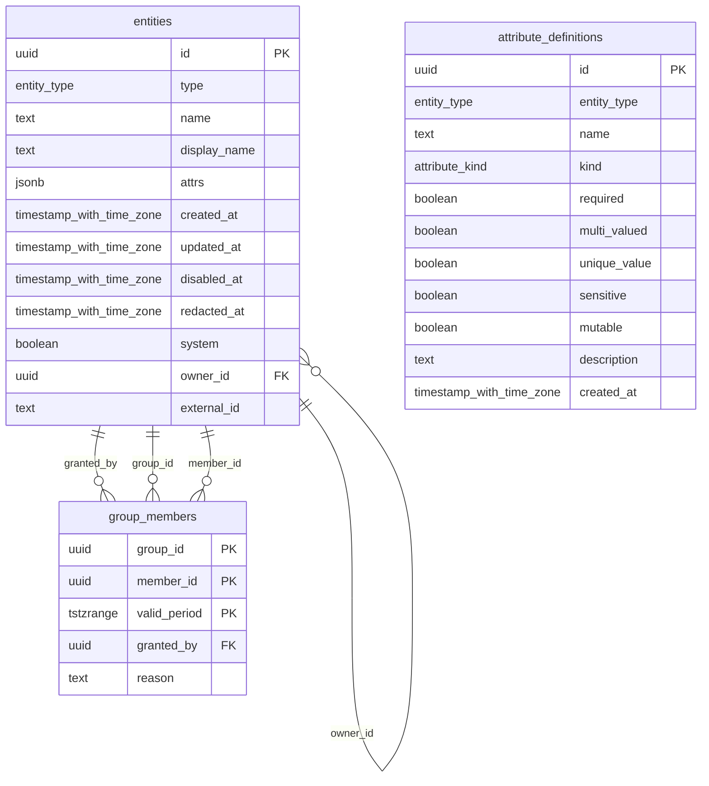
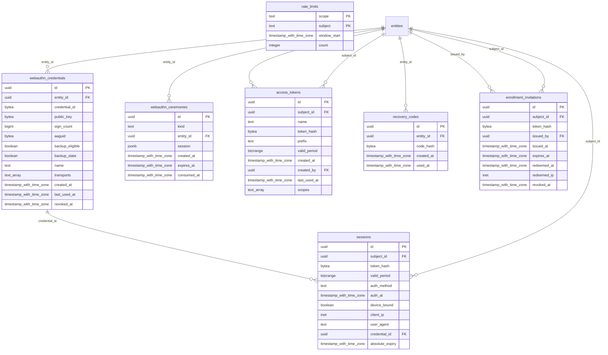
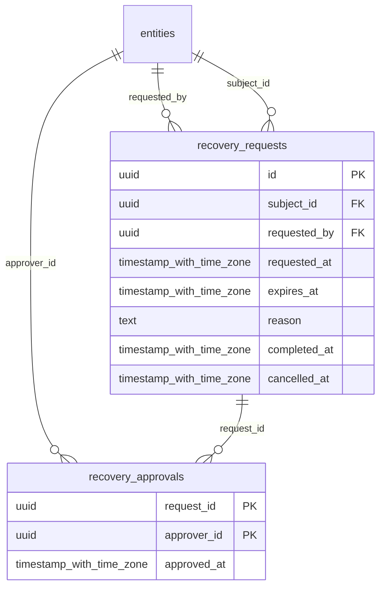
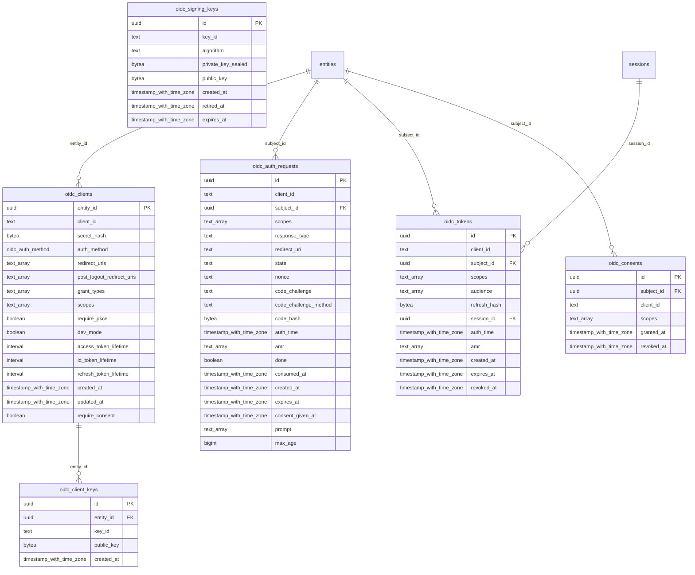
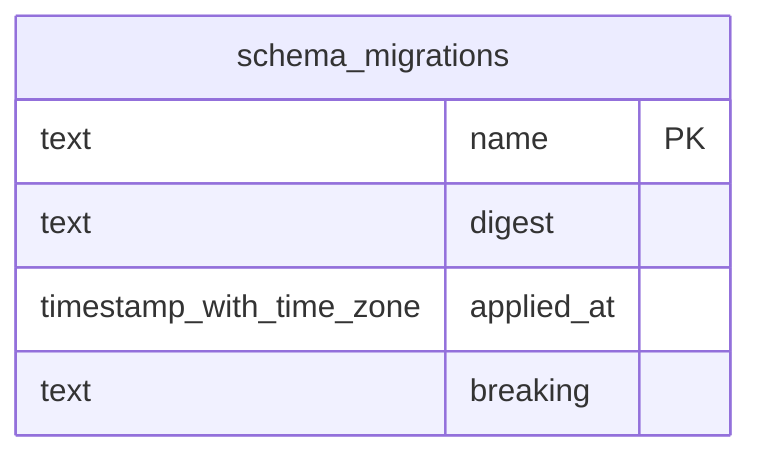

# Database schema

<!-- Generated by `make schema`. Do not edit by hand: a schema document
     maintained separately from the schema is wrong within a month, and then
     worse than absent, because someone believes it. -->

Cardinal stores everything in one PostgreSQL database and nothing anywhere else
([ADR 0004](adr/0004-postgresql-is-the-only-datastore.md)) — no cache, no
session store, no second datastore to back up or reason about.

Three patterns recur, and reading them once makes the rest obvious:

- **Identity is a UUID.** Names are mutable attributes. Nothing references
  anything by name.
- **Validity is a range, not a flag.** `tstzrange` columns mean a grant, a
  session or a token expires because the range closed, not because a job ran.
  `WITHOUT OVERLAPS` makes contradictory grants impossible at the constraint
  level.
- **Credentials are stored as hashes.** A read of this database yields nothing
  that can be presented back to it.

Diagrams are per domain on purpose: one picture of every table is a hairball
nobody reads, which is the same outcome as having no picture.

## Directory

Identity is an immutable UUID and everything else is an attribute ([ADR 0002](adr/0002-identity-is-an-immutable-uuid.md)). Membership carries a validity period rather than a boolean, so a grant can expire without anything having to run.

### `entities`

Every principal, group, host and application. The groups created by migration — directory-admins, user-admins, security-admins (0008, 0011) and staff-apps, sre, env-prod, engineers, env-dev, platform-admins (0027) — are referenced by the default policy set through their identifiers, so renaming one is safe and deleting one silently removes whatever the rule naming it was granting.

| Column | Type | Null | Default | Notes |
|---|---|---|---|---|
| `id` | `uuid` | no | `uuidv7()` | Immutable UUIDv7. Never changes, never reused. The only true identifier. |
| `type` | `entity_type` | no |  |  |
| `name` | `text` | no |  | Mutable human-readable name, unique per type. NOT an identifier. The built-in groups directory-admins, user-admins and security-admins are created by migration and referenced by the default policy set through their identifiers, so renaming them is safe and deleting them removes a tier of administrative authority. |
| `display_name` | `text` | yes |  |  |
| `attrs` | `jsonb` | no | `'{}'::jsonb` |  |
| `created_at` | `timestamp with time zone` | no | `now()` |  |
| `updated_at` | `timestamp with time zone` | no | `now()` |  |
| `disabled_at` | `timestamp with time zone` | yes |  |  |
| `redacted_at` | `timestamp with time zone` | yes |  | When this entity's personal data was erased. The row survives so audit references still resolve, but name/display_name/attrs are tombstoned, the WebAuthn credentials are deleted and disabled_at is set — an erasure that leaves a working credential is not an erasure. See ADR 0010. |
| `system` | `boolean` | no | `false` | Membership of this group confers authority within Cardinal itself. Granting or revoking it requires AdministerDirectory, not merely ManageUsers — otherwise a narrow tier can hand itself a broad one. |
| `owner_id` | `uuid` | yes |  | → `entities.id` — The application a group exists for, if any. Organisational only: Cardinal treats an owned group exactly like any other. |
| `external_id` | `text` | yes |  | The identity provider's own key for this entity, from SCIM. Null for everything Cardinal created itself. Unique where present, so two provisioned accounts cannot claim one upstream identity. |

### `group_members`

Time-bounded membership. Revoke with DELETE ... FOR PORTION OF, which truncates the range rather than erasing the historical fact of the grant.

| Column | Type | Null | Default | Notes |
|---|---|---|---|---|
| `group_id` | `uuid` | no |  | → `entities.id` |
| `member_id` | `uuid` | no |  | → `entities.id` |
| `valid_period` | `tstzrange` | no |  |  |
| `granted_by` | `uuid` | no |  | → `entities.id` |
| `reason` | `text` | yes |  | Free-text justification. Personal data may appear here, so it is nulled on erasure. Never copy this into an event payload -- see ADR 0010. |

### `attribute_definitions`

| Column | Type | Null | Default | Notes |
|---|---|---|---|---|
| `id` | `uuid` | no | `uuidv7()` |  |
| `entity_type` | `entity_type` | no |  |  |
| `name` | `text` | no |  |  |
| `kind` | `attribute_kind` | no |  |  |
| `required` | `boolean` | no | `false` |  |
| `multi_valued` | `boolean` | no | `false` |  |
| `unique_value` | `boolean` | no | `false` |  |
| `sensitive` | `boolean` | no | `false` |  |
| `mutable` | `boolean` | no | `true` |  |
| `description` | `text` | yes |  |  |
| `created_at` | `timestamp with time zone` | no | `now()` |  |

## Authentication

No password column exists. What a person can present is a passkey, a recovery code, or — for a script — an access token, and each is stored as a hash.

### `webauthn_credentials`

Passkey public keys. Contains no secret: a database dump yields nothing that can authenticate as anyone.

| Column | Type | Null | Default | Notes |
|---|---|---|---|---|
| `id` | `uuid` | no | `uuidv7()` |  |
| `entity_id` | `uuid` | no |  | → `entities.id` |
| `credential_id` | `bytea` | no |  |  |
| `public_key` | `bytea` | no |  |  |
| `sign_count` | `bigint` | no | `0` |  |
| `aaguid` | `bytea` | yes |  |  |
| `backup_eligible` | `boolean` | no | `false` |  |
| `backup_state` | `boolean` | no | `false` |  |
| `name` | `text` | no | `''::text` |  |
| `transports` | `text[]` | no | `'{}'::text[]` |  |
| `created_at` | `timestamp with time zone` | no | `now()` |  |
| `last_used_at` | `timestamp with time zone` | yes |  |  |
| `revoked_at` | `timestamp with time zone` | yes |  |  |

### `webauthn_ceremonies`

| Column | Type | Null | Default | Notes |
|---|---|---|---|---|
| `id` | `uuid` | no | `uuidv7()` |  |
| `kind` | `text` | no |  |  |
| `entity_id` | `uuid` | yes |  | → `entities.id` |
| `session` | `jsonb` | no |  |  |
| `created_at` | `timestamp with time zone` | no | `now()` |  |
| `expires_at` | `timestamp with time zone` | no |  |  |
| `consumed_at` | `timestamp with time zone` | yes |  |  |

### `sessions`

| Column | Type | Null | Default | Notes |
|---|---|---|---|---|
| `id` | `uuid` | no | `uuidv7()` |  |
| `subject_id` | `uuid` | no |  | → `entities.id` |
| `token_hash` | `bytea` | no |  |  |
| `valid_period` | `tstzrange` | no |  |  |
| `auth_method` | `text` | no |  |  |
| `auth_at` | `timestamp with time zone` | no | `now()` | When the subject last proved possession of a credential. Policy uses this for step-up; it is not the same as when the session was created. |
| `device_bound` | `boolean` | no | `false` |  |
| `client_ip` | `inet` | yes |  |  |
| `user_agent` | `text` | yes |  |  |
| `credential_id` | `uuid` | yes |  | → `webauthn_credentials.id` |
| `absolute_expiry` | `timestamp with time zone` | no |  | The hard end of this session, never extended. Idle expiry lives in valid_period and slides while the session is used; this is what stops a session being kept alive indefinitely by whoever holds the cookie. |

### `access_tokens`

Bearer credentials for scripts and automation. Never device-bound, so policy refuses them administrative actions.

| Column | Type | Null | Default | Notes |
|---|---|---|---|---|
| `id` | `uuid` | no | `uuidv7()` |  |
| `subject_id` | `uuid` | no |  | → `entities.id` |
| `name` | `text` | no |  |  |
| `token_hash` | `bytea` | no |  |  |
| `prefix` | `text` | no |  |  |
| `valid_period` | `tstzrange` | no |  |  |
| `created_at` | `timestamp with time zone` | no | `now()` |  |
| `created_by` | `uuid` | yes |  | → `entities.id` |
| `last_used_at` | `timestamp with time zone` | yes |  |  |
| `scopes` | `text[]` | no | `'{}'::text[]` | What this token may attempt. A ceiling, not a grant: policy still decides, and a scope can only narrow what the owner could already do. Empty means the token can authenticate and nothing else. |

### `recovery_codes`

| Column | Type | Null | Default | Notes |
|---|---|---|---|---|
| `id` | `uuid` | no | `uuidv7()` |  |
| `entity_id` | `uuid` | no |  | → `entities.id` |
| `code_hash` | `bytea` | no |  |  |
| `created_at` | `timestamp with time zone` | no | `now()` |  |
| `used_at` | `timestamp with time zone` | yes |  |  |

### `enrollment_invitations`

Single-use, short-lived authorisation to register a first passkey on one named account. Safe to send over an untrusted channel: it grants no session, cannot administer, and expires unused.

| Column | Type | Null | Default | Notes |
|---|---|---|---|---|
| `id` | `uuid` | no | `uuidv7()` |  |
| `subject_id` | `uuid` | no |  | → `entities.id` |
| `token_hash` | `bytea` | no |  | sha256 of the invitation token. The token itself is shown once, at issue, and is not recoverable. |
| `issued_by` | `uuid` | yes |  | → `entities.id` |
| `issued_at` | `timestamp with time zone` | no | `now()` |  |
| `expires_at` | `timestamp with time zone` | no |  |  |
| `redeemed_at` | `timestamp with time zone` | yes |  |  |
| `redeemed_ip` | `inet` | yes |  |  |
| `revoked_at` | `timestamp with time zone` | yes |  |  |

### `rate_limits`

Fixed-window counters. Imprecise at window boundaries by design: this bounds online guessing, it is not an accounting record.

| Column | Type | Null | Default | Notes |
|---|---|---|---|---|
| `scope` | `text` | no |  |  |
| `subject` | `text` | no |  |  |
| `window_start` | `timestamp with time zone` | no |  |  |
| `count` | `integer` | no | `0` |  |

## Recovery

Restoring an account that can already sign in needs two administrators, neither of them the subject ([ADR 0015](adr/0015-dual-control-recovery.md)).

### `recovery_requests`

Dual-control restoration of access to an account that already has credentials. Two distinct administrators, neither of them the subject.

| Column | Type | Null | Default | Notes |
|---|---|---|---|---|
| `id` | `uuid` | no | `uuidv7()` |  |
| `subject_id` | `uuid` | no |  | → `entities.id` |
| `requested_by` | `uuid` | no |  | → `entities.id` |
| `requested_at` | `timestamp with time zone` | no | `now()` |  |
| `expires_at` | `timestamp with time zone` | no |  |  |
| `reason` | `text` | no | `''::text` |  |
| `completed_at` | `timestamp with time zone` | yes |  |  |
| `cancelled_at` | `timestamp with time zone` | yes |  |  |

### `recovery_approvals`

| Column | Type | Null | Default | Notes |
|---|---|---|---|---|
| `request_id` | `uuid` | no |  | → `recovery_requests.id` |
| `approver_id` | `uuid` | no |  | → `entities.id` |
| `approved_at` | `timestamp with time zone` | no | `now()` |  |

## OpenID Connect

An application is a directory entity with client configuration attached, so it can be a group member and a policy subject like anything else.

### `oidc_clients`

| Column | Type | Null | Default | Notes |
|---|---|---|---|---|
| `entity_id` | `uuid` | no |  | → `entities.id` |
| `client_id` | `text` | no |  |  |
| `secret_hash` | `bytea` | yes |  |  |
| `auth_method` | `oidc_auth_method` | no | `'none'::oidc_auth_method` |  |
| `redirect_uris` | `text[]` | no | `'{}'::text[]` |  |
| `post_logout_redirect_uris` | `text[]` | no | `'{}'::text[]` |  |
| `grant_types` | `text[]` | no | `'{authorization_code}'::text[]` |  |
| `scopes` | `text[]` | no | `'{openid,profile,email,groups}'::text[]` |  |
| `require_pkce` | `boolean` | no | `true` |  |
| `dev_mode` | `boolean` | no | `false` |  |
| `access_token_lifetime` | `interval` | no | `'00:15:00'::interval` |  |
| `id_token_lifetime` | `interval` | no | `'00:15:00'::interval` |  |
| `refresh_token_lifetime` | `interval` | no | `'720:00:00'::interval` |  |
| `created_at` | `timestamp with time zone` | no | `now()` |  |
| `updated_at` | `timestamp with time zone` | no | `now()` |  |
| `require_consent` | `boolean` | no | `false` | Ask the user before releasing claims to this application. Off by default: a consent prompt for a first-party application is one more thing people learn to dismiss without reading. |

### `oidc_client_keys`

| Column | Type | Null | Default | Notes |
|---|---|---|---|---|
| `id` | `uuid` | no | `uuidv7()` |  |
| `entity_id` | `uuid` | no |  | → `oidc_clients.entity_id` |
| `key_id` | `text` | no |  |  |
| `public_key` | `bytea` | no |  |  |
| `created_at` | `timestamp with time zone` | no | `now()` |  |

### `oidc_auth_requests`

| Column | Type | Null | Default | Notes |
|---|---|---|---|---|
| `id` | `uuid` | no | `uuidv7()` |  |
| `client_id` | `text` | no |  |  |
| `subject_id` | `uuid` | yes |  | → `entities.id` |
| `scopes` | `text[]` | no | `'{}'::text[]` |  |
| `response_type` | `text` | no |  |  |
| `redirect_uri` | `text` | no |  |  |
| `state` | `text` | yes |  |  |
| `nonce` | `text` | yes |  |  |
| `code_challenge` | `text` | yes |  |  |
| `code_challenge_method` | `text` | yes |  |  |
| `code_hash` | `bytea` | yes |  |  |
| `auth_time` | `timestamp with time zone` | yes |  |  |
| `amr` | `text[]` | no | `'{}'::text[]` |  |
| `done` | `boolean` | no | `false` |  |
| `consumed_at` | `timestamp with time zone` | yes |  |  |
| `created_at` | `timestamp with time zone` | no | `now()` |  |
| `expires_at` | `timestamp with time zone` | no |  |  |
| `consent_given_at` | `timestamp with time zone` | yes |  |  |
| `prompt` | `text[]` | yes |  | OIDC prompt values from the authorization request: none, login, consent, select_account. |
| `max_age` | `bigint` | yes |  | OIDC max_age in seconds; NULL means the client did not constrain authentication age. |

### `oidc_tokens`

| Column | Type | Null | Default | Notes |
|---|---|---|---|---|
| `id` | `uuid` | no | `uuidv7()` |  |
| `client_id` | `text` | no |  |  |
| `subject_id` | `uuid` | no |  | → `entities.id` |
| `scopes` | `text[]` | no | `'{}'::text[]` |  |
| `audience` | `text[]` | no | `'{}'::text[]` |  |
| `refresh_hash` | `bytea` | yes |  |  |
| `session_id` | `uuid` | yes |  | → `sessions.id` |
| `auth_time` | `timestamp with time zone` | no |  |  |
| `amr` | `text[]` | no | `'{}'::text[]` |  |
| `created_at` | `timestamp with time zone` | no | `now()` |  |
| `expires_at` | `timestamp with time zone` | no |  |  |
| `revoked_at` | `timestamp with time zone` | yes |  |  |

### `oidc_consents`

| Column | Type | Null | Default | Notes |
|---|---|---|---|---|
| `id` | `uuid` | no | `uuidv7()` |  |
| `subject_id` | `uuid` | no |  | → `entities.id` |
| `client_id` | `text` | no |  |  |
| `scopes` | `text[]` | no | `'{}'::text[]` |  |
| `granted_at` | `timestamp with time zone` | no | `now()` |  |
| `revoked_at` | `timestamp with time zone` | yes |  |  |

### `oidc_signing_keys`

| Column | Type | Null | Default | Notes |
|---|---|---|---|---|
| `id` | `uuid` | no | `uuidv7()` |  |
| `key_id` | `text` | no |  |  |
| `algorithm` | `text` | no | `'RS256'::text` |  |
| `private_key_sealed` | `bytea` | no |  |  |
| `public_key` | `bytea` | no |  |  |
| `created_at` | `timestamp with time zone` | no | `now()` |  |
| `retired_at` | `timestamp with time zone` | yes |  |  |
| `expires_at` | `timestamp with time zone` | yes |  |  |

## Policy and audit

`events` is a hash-chained journal with **no foreign key to entities**, deliberately: erasure must not be able to break the chain. `decisions` does reference the principal, which is why a user with decisions against them is redacted rather than deleted.

```mermaid
erDiagram
    policy_versions {
        uuid id PK
        bigint version
        text document
        bytea digest
        text description
        timestamp_with_time_zone created_at
        uuid created_by FK
        timestamp_with_time_zone activated_at
    }
    decisions {
        uuid id PK
        timestamp_with_time_zone decided_at PK
        text decision_point
        uuid principal_id FK
        text action
        text resource
        boolean allowed
        text_array reasons
        text_array errors
        bigint policy_version
        jsonb context
        integer duration_us
    }
    events {
        bigint seq PK
        uuid id
        timestamp_with_time_zone occurred_at PK
        text action
        uuid entity_id
        uuid actor_id
        jsonb payload
        bytea prev_hash
        bytea hash
    }
    entities ||--o{ policy_versions : created_by
    entities ||--o{ decisions : principal_id
```

### `policy_versions`

| Column | Type | Null | Default | Notes |
|---|---|---|---|---|
| `id` | `uuid` | no | `uuidv7()` |  |
| `version` | `bigint` | no |  |  |
| `document` | `text` | no |  |  |
| `digest` | `bytea` | no |  |  |
| `description` | `text` | no | `''::text` |  |
| `created_at` | `timestamp with time zone` | no | `now()` |  |
| `created_by` | `uuid` | yes |  | → `entities.id` |
| `activated_at` | `timestamp with time zone` | yes |  |  |

### `decisions`

Every authorization decision and the policy that made it. Distinct from the events journal: that is tamper-evident audit of *changes*, this is high-volume observability of *access*, with its own retention.

Partitioned by time: `decisions_2026`, `decisions_2027`. Retention is a partition drop rather than a delete.

| Column | Type | Null | Default | Notes |
|---|---|---|---|---|
| `id` | `uuid` | no | `uuidv7()` |  |
| `decided_at` | `timestamp with time zone` | no | `now()` |  |
| `decision_point` | `text` | no |  |  |
| `principal_id` | `uuid` | yes |  | → `entities.id` |
| `action` | `text` | no |  |  |
| `resource` | `text` | no |  |  |
| `allowed` | `boolean` | no |  |  |
| `reasons` | `text[]` | no | `'{}'::text[]` |  |
| `errors` | `text[]` | no | `'{}'::text[]` |  |
| `policy_version` | `bigint` | yes |  |  |
| `context` | `jsonb` | no | `'{}'::jsonb` |  |
| `duration_us` | `integer` | no | `0` |  |

### `events`

Partitioned by time: `events_2026`, `events_2027`. Retention is a partition drop rather than a delete.

| Column | Type | Null | Default | Notes |
|---|---|---|---|---|
| `seq` | `bigint` | no |  |  |
| `id` | `uuid` | no | `uuidv7()` |  |
| `occurred_at` | `timestamp with time zone` | no | `now()` |  |
| `action` | `text` | no |  |  |
| `entity_id` | `uuid` | yes |  |  |
| `actor_id` | `uuid` | yes |  |  |
| `payload` | `jsonb` | no | `'{}'::jsonb` |  |
| `prev_hash` | `bytea` | yes |  |  |
| `hash` | `bytea` | no |  |  |

## Schema

Applied migrations. Written by `cardinal migrate`.

### `schema_migrations`

| Column | Type | Null | Default | Notes |
|---|---|---|---|---|
| `name` | `text` | no |  |  |
| `digest` | `text` | no |  |  |
| `applied_at` | `timestamp with time zone` | no | `now()` |  |
| `breaking` | `text` | yes |  |  |

## Other

**Not yet grouped.** These tables exist in the database but are not assigned to a domain in `tools/schemadoc/main.go`. Assign them there so this document stays a map rather than a list.

```mermaid
erDiagram
    acme_accounts {
        uuid id PK
        uuid subject_id FK
        text thumbprint
        jsonb public_jwk
        text_array contact
        timestamp_with_time_zone created_at
        timestamp_with_time_zone deactivated_at
    }
    acme_authorizations {
        uuid id PK
        uuid order_id FK
        text identifier
        text status
        timestamp_with_time_zone expires_at
    }
    acme_eab_credentials {
        uuid id PK
        uuid subject_id FK
        text key_id
        bytea hmac_sealed
        uuid issued_by FK
        timestamp_with_time_zone issued_at
        timestamp_with_time_zone expires_at
        timestamp_with_time_zone redeemed_at
        timestamp_with_time_zone revoked_at
    }
    acme_nonces {
        text nonce PK
        timestamp_with_time_zone issued_at
    }
    acme_orders {
        uuid id PK
        uuid account_id FK
        text status
        text_array identifiers
        timestamp_with_time_zone not_before
        timestamp_with_time_zone not_after
        timestamp_with_time_zone created_at
        timestamp_with_time_zone expires_at
        bytea certificate
        uuid ca_key_id FK
        text serial
    }
    application_group_projection {
        uuid entity_id PK
        text mode
        timestamp_with_time_zone updated_at
        uuid updated_by FK
    }
    application_hostnames {
        text hostname PK
        uuid entity_id FK
        timestamp_with_time_zone added_at
        uuid added_by FK
    }
    application_visible_groups {
        uuid application_id PK
        uuid group_id PK
        timestamp_with_time_zone added_at
        uuid added_by FK
    }
    cli_authorizations {
        uuid id PK
        text code_hash
        text verifier_hash
        uuid session_id FK
        timestamp_with_time_zone created_at
        timestamp_with_time_zone expires_at
        timestamp_with_time_zone claimed_at
    }
    host_aliases {
        uuid host_id PK
        text name PK
        timestamp_with_time_zone added_at
        uuid added_by FK
    }
    host_credentials {
        uuid id PK
        uuid host_id FK
        text public_key
        text fingerprint
        tstzrange valid_period
        timestamp_with_time_zone enrolled_at
        inet enrolled_ip
        timestamp_with_time_zone last_seen_at
    }
    host_enrollment_tokens {
        uuid id PK
        uuid host_id FK
        bytea token_hash
        uuid issued_by FK
        timestamp_with_time_zone issued_at
        timestamp_with_time_zone expires_at
        timestamp_with_time_zone redeemed_at
        inet redeemed_ip
        timestamp_with_time_zone revoked_at
    }
    mail_outbox {
        uuid id PK
        uuid subject_id FK
        text recipient
        text kind
        text subject_line
        text body
        timestamp_with_time_zone created_at
        timestamp_with_time_zone next_attempt_at
        integer attempts
        timestamp_with_time_zone sent_at
        text last_error
    }
    mail_settings {
        boolean id PK
        boolean enabled
        text host
        integer port
        text username
        bytea password_sealed
        text from_address
        text from_name
        text reply_to
        text tls_mode
        timestamp_with_time_zone updated_at
        uuid updated_by FK
    }
    mail_templates {
        text kind PK
        text subject
        text body
        timestamp_with_time_zone updated_at
        uuid updated_by FK
    }
    posix_identities {
        uuid entity_id PK
        integer id_number
        text home_directory
        text login_shell
        timestamp_with_time_zone assigned_at
        timestamp_with_time_zone first_served_at
    }
    ssf_events {
        uuid id PK
        uuid stream_id FK
        uuid subject_id FK
        text event_type
        text token
        timestamp_with_time_zone created_at
        timestamp_with_time_zone next_attempt_at
        integer attempts
        timestamp_with_time_zone delivered_at
        text last_error
        uuid jti
    }
    ssf_streams {
        uuid id PK
        uuid entity_id FK
        text endpoint
        text_array events
        boolean enabled
        timestamp_with_time_zone created_at
        timestamp_with_time_zone updated_at
        uuid created_by FK
        text delivery_method
    }
    ssf_watermark {
        boolean id PK
        bigint seq
    }
    ssh_ca_keys {
        uuid id PK
        text algorithm
        bytea private_key_sealed
        text public_key
        text fingerprint
        timestamp_with_time_zone created_at
        timestamp_with_time_zone active_at
        timestamp_with_time_zone retired_at
        timestamp_with_time_zone valid_until
    }
    ssh_certificates {
        uuid id PK
        bigint serial
        uuid subject_id FK
        uuid host_id FK
        text_array principals
        uuid ca_key_id FK
        text key_id
        timestamp_with_time_zone issued_at
        timestamp_with_time_zone expires_at
    }
    x509_ca_keys {
        uuid id PK
        text algorithm
        bytea private_key_sealed
        bytea certificate
        bytea_array chain
        text fingerprint
        text subject
        timestamp_with_time_zone not_before
        timestamp_with_time_zone not_after
        timestamp_with_time_zone created_at
        timestamp_with_time_zone active_at
        timestamp_with_time_zone retired_at
    }
    entities ||--o{ acme_accounts : subject_id
    acme_orders ||--o{ acme_authorizations : order_id
    entities ||--o{ acme_eab_credentials : issued_by
    entities ||--o{ acme_eab_credentials : subject_id
    acme_accounts ||--o{ acme_orders : account_id
    x509_ca_keys ||--o{ acme_orders : ca_key_id
    entities ||--o{ application_group_projection : entity_id
    entities ||--o{ application_group_projection : updated_by
    entities ||--o{ application_hostnames : added_by
    entities ||--o{ application_hostnames : entity_id
    entities ||--o{ application_visible_groups : added_by
    entities ||--o{ application_visible_groups : application_id
    entities ||--o{ application_visible_groups : group_id
    sessions ||--o{ cli_authorizations : session_id
    entities ||--o{ host_aliases : added_by
    entities ||--o{ host_aliases : host_id
    entities ||--o{ host_credentials : host_id
    entities ||--o{ host_enrollment_tokens : host_id
    entities ||--o{ host_enrollment_tokens : issued_by
    entities ||--o{ mail_outbox : subject_id
    entities ||--o{ mail_settings : updated_by
    entities ||--o{ mail_templates : updated_by
    entities ||--o{ posix_identities : entity_id
    ssf_streams ||--o{ ssf_events : stream_id
    entities ||--o{ ssf_events : subject_id
    entities ||--o{ ssf_streams : created_by
    oidc_clients ||--o{ ssf_streams : entity_id
    ssh_ca_keys ||--o{ ssh_certificates : ca_key_id
    entities ||--o{ ssh_certificates : host_id
    entities ||--o{ ssh_certificates : subject_id
```

### `acme_accounts`

| Column | Type | Null | Default | Notes |
|---|---|---|---|---|
| `id` | `uuid` | no | `uuidv7()` |  |
| `subject_id` | `uuid` | no |  | → `entities.id` |
| `thumbprint` | `text` | no |  |  |
| `public_jwk` | `jsonb` | no |  |  |
| `contact` | `text[]` | no | `'{}'::text[]` |  |
| `created_at` | `timestamp with time zone` | no | `now()` |  |
| `deactivated_at` | `timestamp with time zone` | yes |  |  |

### `acme_authorizations`

One per identifier. Always born valid: control of the name was established at enrollment, not by a challenge.

| Column | Type | Null | Default | Notes |
|---|---|---|---|---|
| `id` | `uuid` | no | `uuidv7()` |  |
| `order_id` | `uuid` | no |  | → `acme_orders.id` |
| `identifier` | `text` | no |  |  |
| `status` | `text` | no |  |  |
| `expires_at` | `timestamp with time zone` | no |  |  |

### `acme_eab_credentials`

| Column | Type | Null | Default | Notes |
|---|---|---|---|---|
| `id` | `uuid` | no | `uuidv7()` |  |
| `subject_id` | `uuid` | no |  | → `entities.id` |
| `key_id` | `text` | no |  |  |
| `hmac_sealed` | `bytea` | no |  |  |
| `issued_by` | `uuid` | yes |  | → `entities.id` |
| `issued_at` | `timestamp with time zone` | no | `now()` |  |
| `expires_at` | `timestamp with time zone` | no |  |  |
| `redeemed_at` | `timestamp with time zone` | yes |  |  |
| `revoked_at` | `timestamp with time zone` | yes |  |  |

### `acme_nonces`

| Column | Type | Null | Default | Notes |
|---|---|---|---|---|
| `nonce` | `text` | no |  |  |
| `issued_at` | `timestamp with time zone` | no | `now()` |  |

### `acme_orders`

| Column | Type | Null | Default | Notes |
|---|---|---|---|---|
| `id` | `uuid` | no | `uuidv7()` |  |
| `account_id` | `uuid` | no |  | → `acme_accounts.id` |
| `status` | `text` | no |  |  |
| `identifiers` | `text[]` | no |  |  |
| `not_before` | `timestamp with time zone` | yes |  |  |
| `not_after` | `timestamp with time zone` | yes |  |  |
| `created_at` | `timestamp with time zone` | no | `now()` |  |
| `expires_at` | `timestamp with time zone` | no |  |  |
| `certificate` | `bytea` | yes |  |  |
| `ca_key_id` | `uuid` | yes |  | → `x509_ca_keys.id` |
| `serial` | `text` | yes |  |  |

### `application_group_projection`

How much of a subject's group closure this application is told about. Affects the forwardAuth header and the OIDC groups claim only — Cedar always evaluates the full closure, so this cannot change a decision.

| Column | Type | Null | Default | Notes |
|---|---|---|---|---|
| `entity_id` | `uuid` | no |  | → `entities.id` |
| `mode` | `text` | no |  |  |
| `updated_at` | `timestamp with time zone` | no | `now()` |  |
| `updated_by` | `uuid` | yes |  | → `entities.id` |

### `application_hostnames`

Maps a hostname Traefik forwards to the application entity it belongs to. A hostname with no row here is refused by forwardAuth before policy is consulted, the same way an unenrolled machine is refused an SSH certificate: Cardinal decides about things the directory knows.

| Column | Type | Null | Default | Notes |
|---|---|---|---|---|
| `hostname` | `text` | no |  |  |
| `entity_id` | `uuid` | no |  | → `entities.id` |
| `added_at` | `timestamp with time zone` | no | `now()` |  |
| `added_by` | `uuid` | yes |  | → `entities.id` |

### `application_visible_groups`

Groups an application is told about that it does not own. The escape hatch for a projection in owned mode; ignored in all mode.

| Column | Type | Null | Default | Notes |
|---|---|---|---|---|
| `application_id` | `uuid` | no |  | → `entities.id` |
| `group_id` | `uuid` | no |  | → `entities.id` |
| `added_at` | `timestamp with time zone` | no | `now()` |  |
| `added_by` | `uuid` | yes |  | → `entities.id` |

### `cli_authorizations`

| Column | Type | Null | Default | Notes |
|---|---|---|---|---|
| `id` | `uuid` | no | `uuidv7()` |  |
| `code_hash` | `text` | no |  |  |
| `verifier_hash` | `text` | no |  |  |
| `session_id` | `uuid` | no |  | → `sessions.id` |
| `created_at` | `timestamp with time zone` | no | `now()` |  |
| `expires_at` | `timestamp with time zone` | no |  |  |
| `claimed_at` | `timestamp with time zone` | yes |  |  |

### `host_aliases`

Additional names a host may hold a certificate for. Unique across all hosts.

| Column | Type | Null | Default | Notes |
|---|---|---|---|---|
| `host_id` | `uuid` | no |  | → `entities.id` |
| `name` | `text` | no |  |  |
| `added_at` | `timestamp with time zone` | no | `now()` |  |
| `added_by` | `uuid` | yes |  | → `entities.id` |

### `host_credentials`

Public keys hosts authenticate with. Cardinal never holds the private half.

| Column | Type | Null | Default | Notes |
|---|---|---|---|---|
| `id` | `uuid` | no | `uuidv7()` |  |
| `host_id` | `uuid` | no |  | → `entities.id` |
| `public_key` | `text` | no |  |  |
| `fingerprint` | `text` | no |  |  |
| `valid_period` | `tstzrange` | no |  |  |
| `enrolled_at` | `timestamp with time zone` | no | `now()` |  |
| `enrolled_ip` | `inet` | yes |  |  |
| `last_seen_at` | `timestamp with time zone` | yes |  |  |

### `host_enrollment_tokens`

Single-use tokens that let a machine register its key once. Hashed at rest.

| Column | Type | Null | Default | Notes |
|---|---|---|---|---|
| `id` | `uuid` | no | `uuidv7()` |  |
| `host_id` | `uuid` | no |  | → `entities.id` |
| `token_hash` | `bytea` | no |  |  |
| `issued_by` | `uuid` | yes |  | → `entities.id` |
| `issued_at` | `timestamp with time zone` | no | `now()` |  |
| `expires_at` | `timestamp with time zone` | no |  |  |
| `redeemed_at` | `timestamp with time zone` | yes |  |  |
| `redeemed_ip` | `inet` | yes |  |  |
| `revoked_at` | `timestamp with time zone` | yes |  |  |

### `mail_outbox`

| Column | Type | Null | Default | Notes |
|---|---|---|---|---|
| `id` | `uuid` | no | `uuidv7()` |  |
| `subject_id` | `uuid` | yes |  | → `entities.id` |
| `recipient` | `text` | no |  |  |
| `kind` | `text` | no |  |  |
| `subject_line` | `text` | no |  |  |
| `body` | `text` | no |  |  |
| `created_at` | `timestamp with time zone` | no | `now()` |  |
| `next_attempt_at` | `timestamp with time zone` | no | `now()` |  |
| `attempts` | `integer` | no | `0` |  |
| `sent_at` | `timestamp with time zone` | yes |  |  |
| `last_error` | `text` | yes |  |  |

### `mail_settings`

| Column | Type | Null | Default | Notes |
|---|---|---|---|---|
| `id` | `boolean` | no | `true` |  |
| `enabled` | `boolean` | no | `false` |  |
| `host` | `text` | no | `''::text` |  |
| `port` | `integer` | no | `587` |  |
| `username` | `text` | no | `''::text` |  |
| `password_sealed` | `bytea` | yes |  |  |
| `from_address` | `text` | no | `''::text` |  |
| `from_name` | `text` | no | `''::text` |  |
| `reply_to` | `text` | no | `''::text` |  |
| `tls_mode` | `text` | no | `'starttls'::text` |  |
| `updated_at` | `timestamp with time zone` | no | `now()` |  |
| `updated_by` | `uuid` | yes |  | → `entities.id` |

### `mail_templates`

| Column | Type | Null | Default | Notes |
|---|---|---|---|---|
| `kind` | `text` | no |  |  |
| `subject` | `text` | no |  |  |
| `body` | `text` | no |  |  |
| `updated_at` | `timestamp with time zone` | no | `now()` |  |
| `updated_by` | `uuid` | yes |  | → `entities.id` |

### `posix_identities`

uid and gid numbers. One allocator for both, never reused, never changed.

| Column | Type | Null | Default | Notes |
|---|---|---|---|---|
| `entity_id` | `uuid` | no |  | → `entities.id` |
| `id_number` | `integer` | no |  | uid for a user, gid for a group. Unique across both so the two cannot collide. |
| `home_directory` | `text` | yes |  |  |
| `login_shell` | `text` | yes |  |  |
| `assigned_at` | `timestamp with time zone` | no | `now()` |  |
| `first_served_at` | `timestamp with time zone` | yes |  | When a host was first told this number. NULL means it may still be changed; set means it is on a filesystem somewhere and is now permanent. |

### `ssf_events`

| Column | Type | Null | Default | Notes |
|---|---|---|---|---|
| `id` | `uuid` | no | `uuidv7()` |  |
| `stream_id` | `uuid` | no |  | → `ssf_streams.id` |
| `subject_id` | `uuid` | yes |  | → `entities.id` |
| `event_type` | `text` | no |  |  |
| `token` | `text` | no |  | A Security Event Token (RFC 8417), signed with the OIDC signing key so a receiver verifies it against the JWKS it already fetches. No new key distribution, and rotation is the one that already exists. |
| `created_at` | `timestamp with time zone` | no | `now()` |  |
| `next_attempt_at` | `timestamp with time zone` | no | `now()` |  |
| `attempts` | `integer` | no | `0` |  |
| `delivered_at` | `timestamp with time zone` | yes |  |  |
| `last_error` | `text` | yes |  |  |
| `jti` | `uuid` | yes |  | The jti of the signed token, lifted out so RFC 8936 poll responses can be keyed by it and acknowledged by it without parsing the token. |

### `ssf_streams`

Receivers Cardinal sends security events to. push (RFC 8935) posts each event to the receiver's endpoint; poll (RFC 8936) holds it until the receiver collects it with a credential of its own. Streams are configured by an administrator: stream management over the API is not implemented, and the SSF configuration document says so.

| Column | Type | Null | Default | Notes |
|---|---|---|---|---|
| `id` | `uuid` | no | `uuidv7()` |  |
| `entity_id` | `uuid` | no |  | → `oidc_clients.entity_id` |
| `endpoint` | `text` | no |  |  |
| `events` | `text[]` | no | `'{}'::text[]` |  |
| `enabled` | `boolean` | no | `true` |  |
| `created_at` | `timestamp with time zone` | no | `now()` |  |
| `updated_at` | `timestamp with time zone` | no | `now()` |  |
| `created_by` | `uuid` | yes |  | → `entities.id` |
| `delivery_method` | `text` | no | `'push'::text` | push (RFC 8935) posts each event to endpoint; poll (RFC 8936) holds it until the receiver asks. Poll streams have no endpoint: the receiver connects to Cardinal. |

### `ssf_watermark`

| Column | Type | Null | Default | Notes |
|---|---|---|---|---|
| `id` | `boolean` | no | `true` |  |
| `seq` | `bigint` | no | `0` |  |

### `ssh_ca_keys`

SSH certificate authority keys. Several may be trusted at once; exactly one signs.

| Column | Type | Null | Default | Notes |
|---|---|---|---|---|
| `id` | `uuid` | no | `uuidv7()` |  |
| `algorithm` | `text` | no | `'ssh-ed25519'::text` |  |
| `private_key_sealed` | `bytea` | no |  |  |
| `public_key` | `text` | no |  | authorized_keys format. Goes into TrustedUserCAKeys on every host. |
| `fingerprint` | `text` | no |  |  |
| `created_at` | `timestamp with time zone` | no | `now()` |  |
| `active_at` | `timestamp with time zone` | yes |  |  |
| `retired_at` | `timestamp with time zone` | yes |  |  |
| `valid_until` | `timestamp with time zone` | yes |  |  |

### `ssh_certificates`

A record that a certificate was issued. The certificate itself is not stored: it is short-lived, and a copy would be somewhere to steal one from.

| Column | Type | Null | Default | Notes |
|---|---|---|---|---|
| `id` | `uuid` | no | `uuidv7()` |  |
| `serial` | `bigint` | no |  |  |
| `subject_id` | `uuid` | no |  | → `entities.id` |
| `host_id` | `uuid` | yes |  | → `entities.id` |
| `principals` | `text[]` | no |  |  |
| `ca_key_id` | `uuid` | no |  | → `ssh_ca_keys.id` |
| `key_id` | `text` | no |  |  |
| `issued_at` | `timestamp with time zone` | no | `now()` |  |
| `expires_at` | `timestamp with time zone` | no |  |  |

### `x509_ca_keys`

X.509 authority keys. Several may be trusted at once; exactly one signs.

| Column | Type | Null | Default | Notes |
|---|---|---|---|---|
| `id` | `uuid` | no | `uuidv7()` |  |
| `algorithm` | `text` | no | `'ecdsa-p256'::text` |  |
| `private_key_sealed` | `bytea` | no |  |  |
| `certificate` | `bytea` | no |  |  |
| `chain` | `bytea[]` | no | `'{}'::bytea[]` | Intermediates above this key, leaf-to-root, excluding the root. Empty when this key is the root. |
| `fingerprint` | `text` | no |  |  |
| `subject` | `text` | no |  |  |
| `not_before` | `timestamp with time zone` | no |  |  |
| `not_after` | `timestamp with time zone` | no |  |  |
| `created_at` | `timestamp with time zone` | no | `now()` |  |
| `active_at` | `timestamp with time zone` | yes |  |  |
| `retired_at` | `timestamp with time zone` | yes |  |  |

